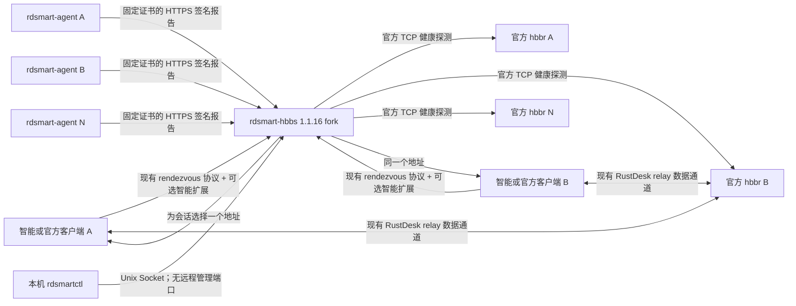

# 智能多中继第二阶段技术规格

## 0. 文档状态

- 状态：首版规格已冻结（2026-08-10），并于 2026-08-13 根据锁定上游 wire 证据纠正 official/old requester 兼容合同；纠正后协议、调度/账本、运维/安全合同无已知剩余 P0/P1 冲突。
- 产品决定来源：`MULTI_RELAY_PHASE2_DECISIONS.md` 中的 0–44 项决定。
- 本文只把已锁定的产品决定转成可开发、可测试的工程合同，不授权修改生产环境或开始生产代码。
- 本文中的“必须 / MUST”是首版验收条件；“应该 / SHOULD”是默认实现，若实现时偏离必须记录原因和测试证据；“可以 / MAY”是兼容扩展点。
- 暂定组件前缀为 `rdsmart`，它是工程代号，不是最终销售名称。

## 1. 目标与结论

第二阶段交付一个完全由客户自托管的智能多中继系统：一个定制 hbbs 管理最多 50 个官方 hbbr 1.1.16 节点，生成的 RustDesk 1.4.9 智能客户端对少量候选 hbbr 做真实 TCP 往返时延测量，hbbs 综合“两端 RTT 总和”、单端质量上限、实时带宽、月流量、维护状态和主机安全保护，为每次需要中继的会话下发同一个单一 hbbr 地址。

这不是替换 RustDesk OSS 多中继，而是在其上增加一层选择器：

1. 官方 hbbs 的 relay 列表和 TCP 健康探测仍判断“节点是否可达”。
2. 节点代理只回答“可达节点中哪个更合适”，不拥有数据通道。
3. 最终仍通过现有 singular `relay_server` 字段把一个 hbbr 下发给会话两端。
4. 官方 hbbr 二进制和配对协议不修改。
5. 智能数据不可用时自动回到兼容选择；旧客户端和普通 1.1.16 hbbs 仍能连接。
6. 显式维护、强制下线和已知月流量耗尽属于管理员硬策略，不能被可用性回退绕过。

首版不承诺会话在 hbbr 故障时无感迁移。已验证的现有语义仍是：连接断开后客户端重新建立会话并由 hbbs 选择可用 relay。

## 2. 精确上游基线

| 部件 | 固定版本 | 固定提交 / 子模块 | 首版处理 |
| --- | --- | --- | --- |
| RustDesk client | 1.4.9 | `6c578292e8ebbbec708b76986ba8c4bc7c509747`；`hbb_common` 为 `7e1c392c62d39c364127307cd408421dd5f8cfb0` | 仅智能构建应用增量补丁 |
| rustdesk-server | 1.1.16 | `73523b31cfd25d77dee862e6fc9f5e1fb5e485ef`；`hbb_common` 为 `83419b6549636ee39dacef7776c473f5802e08d6` | fork hbbs；hbbr 保持官方二进制 |
| rdgen | 当前 `master` | 冻结规格时记录精确提交 | 新增显式构建字段和条件补丁链 |

已核实的兼容锚点：

- `rustdesk-server 1.1.16/src/rendezvous_server.rs` 的 `get_relay_server(pa, pb)` 已接收两端 IP，但当前忽略参数并对 TCP 健康 relay 做全局轮询。这是替换为调度接口的最小服务端切入点。
- 同一文件在 `PunchHole`、`PunchHoleResponse`、`RequestRelay`、`RelayResponse` 路径中仍只传播一个 `relay_server`。
- `rustdesk 1.4.9/src/rendezvous_mediator.rs` 会优先使用本机 `relay-server`；为空才采用 hbbs 下发值。因此智能构建必须继续强制 `override-settings.relay-server=""`。
- `hbb_common/protos/rendezvous.proto` 的现有 relay 字段均为 singular string；新增候选和测速消息必须是 additive，不能改变现有字段号码或含义。

开发时不得直接修改干净参考目录 `D:\rustdesk-生成器\rustdesk-src` 和 `D:\rustdesk-生成器\rustdesk-server-src`。必须从上述固定提交创建独立可写 fork/worktree，并让生成器补丁固定到仓库提交。

## 3. 范围

### 3.1 首版包含

- 一个定制 `rdsmart-hbbs`，单实例控制最多 50 个 relay。
- 官方 `hbbr 1.1.16`，每节点一份，数据通道保持原样。
- 每个专用 relay 主机一个 `rdsmart-agent`，只主动向 controller 发 HTTPS 报告。
- 本机管理工具 `rdsmartctl`，提供人类输出和稳定 JSON。
- Windows x64、Windows x86、Linux、Android 的 RustDesk 1.4.9 智能客户端补丁。
- 生成器显式开关、严格后端校验、配置导入导出、构建记录和条件工作流。
- Ubuntu 22.04/24.04、Debian 12、Rocky 9、Alma 9、CentOS Stream 9 的 x86_64 原生安装。
- IPv4 relay 地址和可解析为 IPv4 的 hostname。
- 无域名时的部署自签身份、证书固定和安全节点注册。
- 结构化日志、状态、审计、备份/恢复和真实多主机验证。

### 3.2 首版不包含

- 客户远程管理 API、Web 管理后台、邮件或 Webhook 通知。
- 云厂商流量 API、自动测速带宽或自动推断套餐额度。
- runtime license、call-home、硬件绑定或转发制品限制。
- 自动升级、跨版本迁移、自动回滚和升级维护窗口。
- hbbs 高可用、多 controller、分布式数据库或共识。
- IPv6、macOS 智能客户端、ARM64 服务端。
- 修改 hbbr、无感会话迁移、并发会话硬上限。
- 共享厂商 relay SaaS 或集中多租户控制平面。

## 4. 总体架构



### 4.1 组件职责

| 组件 | 必须负责 | 明确不负责 |
| --- | --- | --- |
| `rdsmart-hbbs` | 节点注册表、官方 TCP 健康、代理报告接收、流量账本、测速协调、调度、CLI 本机服务、事件与审计 | 转发屏幕数据、云端授权、远程客户管理 UI |
| 官方 `hbbr` | 现有 relay 配对和数据转发 | 上报指标、选路、管理 API |
| `rdsmart-agent` | 主机与网卡指标、单调流量计数、签名报告、接收自身期望状态 | 选择 relay、读取客户端 IP、修改其他业务服务 |
| relay supervisor | 只启动/停止固定路径的官方 hbbr，以兑现 forced-offline | 执行任意命令或管理任意 systemd unit |
| 智能客户端补丁 | 能力协商、少量候选 TCP connect 测速、缓存、网络变化失效、返回结果 | 探测用户 IP、探测全部 50 节点、决定最终 relay |
| `rdsmartctl` | 经本机 socket 调用统一业务操作并输出稳定 JSON | 直接写 SQLite、开放远程监听 |
| rdgen | 选择是否应用智能补丁、校验兼容性、构建和记录 | 作为客户 relay 控制平面 |

relay supervisor 是 relay 安装包内部的窄权限包装器，不修改 hbbr。它是 hbbr 的唯一长期父进程和唯一 systemd unit；hbbr 不另设 `Restart=on-failure` unit。supervisor 以固定非 root relay 用户启动固定二进制/配置，只接受 `start`、`stop`、`status`，agent 不能传路径、参数、环境或 unit 名。

supervisor/agent 必须 fsync 持久化 last applied desired revision。forced-offline applied 后，relay 主机重启且 controller 不可达时保持 hbbr 停止，不能先拉起再等待 ACK。stop 先 TERM，默认 5 秒后 KILL，并确认 child PID 消失、本机目标 listener 消失；本机 socket 用 `SO_PEERCRED` 只允许 agent user。

### 4.2 默认端口

| 方向 | 默认端口 | 用途 |
| --- | --- | --- |
| client → hbbs | 21115/TCP、21116/TCP+UDP | RustDesk 现有 rendezvous/NAT |
| client → hbbs | 21118/TCP | 仅启用 WebSocket 客户端时 |
| client → hbbr | 21117/TCP | 现有 relay 与 TCP connect 测速 |
| client → hbbr | 21119/TCP | 仅启用 WebSocket relay 时 |
| agent → controller | 21120/TCP | TLS 节点注册与签名报告 |
| local CLI → controller | Unix socket | 本机管理，不开放 TCP |

端口均可配置，但一个节点用于调度的候选端口必须与客户端实际可达的 hbbr 端口一致。relay 主机不新增入站管理端口；21120 只在 controller 上监听。

## 5. 不可破坏的可用性规则

系统分别维护三类状态，禁止混为一个 `healthy` 布尔值：

1. `tcp_reachability`：沿用官方 hbbs 主动连接 hbbr 的结果；它决定数据通道是否基本可达。
2. `telemetry_freshness`：代理数据是否足够新；它只决定能否做智能容量判断。
3. `administrative_policy`：active、drain、forced-offline、disabled、quota-exhausted 等显式策略。

选择器必须满足：

- 一次或几次代理报告失败不会立即改变 relay TCP 可达性。
- 代理报告过期时，有新鲜替代节点则不再给该节点分配新会话；旧会话不受影响。
- 若所有基础候选的 telemetry 都过期或遥测子系统不可用，自动进入 `TELEMETRY_GLOBAL_FALLBACK`，在官方 TCP 健康池中继续连接。
- 回退时忽略依赖“当前遥测”的带宽、CPU、内存临时门槛，避免旧指标永久卡死可用性。
- 回退仍必须尊重管理员维护/禁用、forced-offline、地址不受支持和已持久确认的 quota exhaustion。
- `ACCOUNTING_BACKLOG`/`ACCOUNTING_GAP` 在正常智能调度中暂停 metered node 新分配；但它们属于监控/账本链路故障。当这些状态会使监控平面把全部 TCP 健康 relay 排除时，必须进入 OSS availability fallback 并允许连接，同时持续最高级告警、保守显示可能未入账用量，恢复后追补或人工审计修正。它们不能把远控可用性降到 OSS 基线以下。
- agent credential 只授权遥测。吊销/轮换失败会使 telemetry stale，不能直接把 TCP 健康 relay 从 OSS fallback 删除；真正停用数据面必须用 disabled/forced-offline。
- 若所有 TCP 健康节点都被这些显式硬策略排除，返回明确的“没有可用 relay”，不能悄悄违反套餐或维护策略。
- 任何时候都不得把缺失 RTT 当成 0 ms，也不得把代理报告失败当成 hbbr 失败。

## 6. 端到端工作流

### 6.1 节点预创建与注册

1. 管理员在 controller 主机使用 `rdsmartctl node create` 预建节点，设置 relay 地址、带宽、套餐模型和必要阈值。
2. `node enrollment create` 生成 256-bit 随机一次性注册码，默认 15 分钟有效；controller 只保存安全摘要。
3. 输出的 `0600` 注册文件包含 versioned `trust_descriptor`、node ID、一次性码和到期时间。`private_ca` descriptor 包含 mode、controller URL/IP、完整 CA-root certificate DER 和其 SPKI SHA-256；`webpki` descriptor 包含 mode、HTTPS hostname、完整 32-byte deployment Ed25519 public key 和其 SPKI SHA-256。agent 先从完整材料重算并匹配 fingerprint，再把它用作 trust anchor/验签 key；不能假设 TLS peer 会发送 root，也不能拿 hash 本身验签。秘密不得出现在参数、环境变量、journal 或 shell history。
4. agent 本地生成 Ed25519 身份密钥，只上传公钥；先验证 TLS 链及 pin，再提交注册码。
5. controller 在单个 SQLite 事务中验证到期、失败次数和未使用状态，绑定 node ID 与公钥并原子消费注册码。
6. 同一个码的并发请求最多一个成功；默认最多 5 次失败尝试，之后锁定。
7. 后续 agent 请求使用 TLS 加上 node-specific Ed25519 请求签名。controller 不保存节点私钥，也没有全局共享 agent 密钥。

节点身份丢失时必须由管理员签发新的一次性码重新注册。正常轮换由旧、新公钥共同签署轮换请求并短暂重叠；管理员可单独吊销一个节点。

正常轮换流程：CLI 写入 `rotate_credential` desired revision，controller 生成 32-byte 随机一次性 challenge、challenge ID 和 15 分钟 expiry，并用当前 deployment identity 对 node、old credential、desired revision、challenge 和 expiry 签名。agent 验证 challenge 后才在本地生成新 key，调用第 11 节 rotation endpoint，让 old/new key 对同一 challenge canonical request 双签。controller 原子确认 challenge 当前 pending/未消费/未过期并创建 `rotating_pending` credential；第一份新 key 报告成功后激活新 key、撤销旧 key。未使用的 challenge 到期只取消请求并保留旧 key；已创建新 credential 却未在 overlap 内成功报告，则 old/new 两把 key 都撤销，telemetry 变 stale，记录 `ROTATION_CONFIRMATION_EXPIRED` 并要求重新 enrollment。旧 key 已丢失时不能绕过双签，也必须重新 enrollment。

### 6.2 周期报告与流量入账

agent 默认每 5 秒（±20% jitter）发送 protobuf 报告：正常目标 16 KiB，wire/parser/proxy 统一硬上限 32 KiB。失败重试为 1、2、4、8、15、30 秒，之后最多每 60 秒一次；20 秒未接受新报告即 `TELEMETRY_STALE`。

签名信封覆盖 HTTP method、path、body hash、`node_id`、`key_id`、`counter_epoch`、sequence 和 `report_id`。`observed_at_ms` 位于 body 并由 body hash 覆盖；随机 UUID `report_id` 同时充当本报告的 replay nonce，不再另设未编码的 nonce/发送时间字段。规则如下：

- 一个 key/epoch 内 sequence 单调递增。
- 在有界 dedupe window 内，同 report sequence、同 body 的重试必须幂等返回原接受结果；同 sequence、不同 body 必须拒绝并产生安全事件。
- controller 单独保存 `accepted_report_sequence` 高水位与 `accepted_traffic_sequence` checkpoint，禁止混用。已移出 hash window 且 `sequence <= accepted_report_sequence` 的请求统一返回签名的 `REPORT_REPLAY_TOO_OLD` 和当前 traffic checkpoint，不重新入账，也不声称仍能比较旧 body；更大的 report sequence gap 仍拒绝。
- 签名错误、未知 relay、已吊销 key 或超过限流的报告必须拒绝。agent wall clock 与 controller 相差超过 5 分钟时产生 `CLOCK_SKEW`，但 sequence/signature 有效的报告仍可接受；freshness 始终用 controller receive time，避免时钟错误永久制造 stale。
- controller 以接收时间判断 freshness，不能信任 agent 自报时间作为唯一依据。

每份报告至少包含：

- agent/hbbr 版本、boot ID、采样时间、counter epoch/sequence。
- 指定网卡的累计 rx/tx bytes 和当前 rx/tx Mbps。
- 30 秒滚动吞吐摘要。
- CPU 与内存滚动摘要。
- 可选的近似连接数，仅供诊断，绝不成为会话上限。
- 本地 supervisor/hbbr 状态。

agent 在本地持久化逻辑单调累计值。内核计数器重置、重启、wrap、网卡重命名或下降时，从新内核基线继续累加并产生事件，而不是把账本归零。

一分钟 traffic bucket 是正式账期账本的唯一权威输入。累计 RX/TX 只用于实时 provisional usage、连续性校验、恢复请求和 gap 检测，绝不能再把 cumulative delta 加入已由 bucket 覆盖的正式 usage。controller 在同一事务中保存 report 幂等状态、bucket checkpoint 和 billing update；旧备份恢复依赖第 10.4 节的保留/replay 协议，不能承诺任意累计值自动还原跨账期明细。

### 6.3 客户端后台缓存

智能客户端在现有 `RegisterPeer` 和 `RegisterPk` 的新增高编号字段中广告 protocol v1。能力声明由设备现有 Ed25519 key pair 签名；智能 hbbs 只有在能用该 peer 已登记公钥验证后才把 capability 放入在线内存状态。

智能 hbbs 可在常规注册完成后发送一份由 hbbs server key 签名的 `SMART_WARMUP` probe request，其中只有预登记 relay 的小候选目录、安全 timeout 和目录 hash。客户端验证 server 签名后，在自身服务/应用已经活跃时异步测试候选，并把结果只缓存到本机；不为测速额外唤醒 Android、不持有额外 wake lock。

旧 hbbs 忽略未知 capability 字段，也不会发送智能 probe；客户端没有确认过 server capability 时立即保持现有行为，不做额外等待。旧客户端忽略智能 hbbs 的新 oneof 消息。缓存只存 relay ID、candidate-set hash、随机 network epoch、测量时间和结果；不采集 SSID、MAC 或用户公网 IP。

### 6.4 会话调度

只要发起端 A 携带可验签的 smart connect offer，hbbs 必须在把初始 `PunchHole` 转发给 B 之前完成一次有界智能协商。原因是 B 可能因自身 symmetric NAT、proxy 或 WebSocket 在收到 `PunchHole` 后立即连接 relay；若等 A 直连失败后才选点，两端可能进入不同 hbbr。

典型 warm cache 只增加一次短消息往返；cold cache 的 server 截止为 2 秒。智能开关是显式 opt-in，因此首版只对携带可验签 PUNCH offer 的 smart requester 接受这个有界延迟。A 为 official/old 客户端时没有 signed requester identity 或 origin nonce；无论 B 是否广告 smart capability，hbbs 都必须立即走完整 upstream OSS 路径，不等待任何智能 probe，不生成 selection，不创建 smart owner/replay state，也不建立任何基于源 IP/NAT route 的匿名 requester 索引。

智能选择流程：

1. 用两端当前地址只在内存中派生粗粒度 region/ASN；不持久化完整 peer IP。
2. 应用管理员与 TCP 可达性硬门槛，再应用 fresh-telemetry 容量门槛。
3. 对已验证 signed smart requester 的会话，从最多 50 个节点预筛一个默认 4 个、最大 6 个的共同候选集，为 A/B 分别生成 nonce，并用 hbbs server key 签署 probe request。
4. A probe 经本次 PunchHole TCP/WS connection 发送；B probe 优先经其已登记 UDP 地址发送。客户端若有同 network epoch、同 candidate-set hash 的新鲜缓存就直接签名返回，否则在 deadline 内短测后返回。无法投递或旧端直接进入估算分支。
5. 客户端测量预算最多 1.5 秒，hbbs 收集截止最多 2 秒且不得越过现有连接重试窗口；到期立即使用一侧真实值加另一侧估算、两侧估算，最后才使用官方轮询回退。
6. 对有数据的候选按第 9 节算法排序，选择一个 node ID。
7. 在本次 signed smart requester 连接尝试中锁定选择，通过现有 singular `relay_server` 将同一地址送给 A/B，并给 A 返回 server-signed `SmartRelaySelection`。相同 request nonce 的 PunchHole retry 必须幂等复用选择，不能重复 probe。
8. **仅对已声明并验证 signed smart requester 的会话**，后续 `RequestRelay` 必须携带并验签同一 selection，复用原 endpoint，不允许无条件重新调度。selection 默认 120 秒有效；失效/篡改时明确要求客户端重新开始完整 rendezvous attempt，避免 B 已在旧 hbbr 等待而 A 改连新节点。official/old requester 的 `RequestRelay` 不受本条约束，必须保持 unsigned OSS 语义。
9. signed smart requester 会话的原始调度上下文和测速集合正常在完成后立即删除，pending 5 秒过期；异常清理最迟 60 秒硬删除。另保留一个不含 IP/RTT 的 bounded selection replay cache：key 为 `(requester,target,origin_request_nonce)`，value 为 signed selection、initial PUNCH canonical request digest 和 final decision metadata，TTL 与 selection 同为 120 秒、默认最多 4096 项。entry 在首次向 B 转发前写入 crash-consistent 的短期 runtime journal，journal 不含 peer IP/RTT、排除于 backup/普通 CLI/日志并按 TTL 清除，使 hbbs 进程/主机重启后的同 nonce retry 仍复用原 relay。相同 key 但 force-relay/conn type/issued time/其他 signed context digest 不同则返回 `CONNECT_REPLAY_CONTEXT_MISMATCH`。未过期 entry 绝不因容量压力淘汰；cache 满时必须在向 B 转发任何消息前以 retryable `SMART_COORDINATOR_BUSY` 拒绝新的 smart 协商，客户端随后另起一个不带智能扩展的兼容 attempt。entry 到期后同 nonce/旧 issued time 返回 `SELECTION_REPLAY_MISS`，要求客户端用新 nonce 重新开始完整 rendezvous attempt，绝不能悄悄重新选一个节点。

smart A + official/old B 的方向仍在智能会话内：A 的 signed offer 是 admission 根，hbbs 可向 B 发送带 additive selection 的官方 envelope，B 安全忽略未知字段。B 返回不含 echo 的官方 `PunchHoleSent`/`LocalAddr` 或后续 `RelayResponse` 时，hbbs 只能在 target ID、response variant、endpoint、target response source 与 requester writer 组成的上下文可验且唯一时，从已持久的 smart owner 注入原 signed selection 后回给 A；不唯一或不匹配必须 fail closed，不得以 NAT/IP 推测身份。smart `RequestRelay` 对 old B 的无 echo 响应同样只能使用每 UUID 的可验唯一 owner 注入 cached selection。

## 7. Rendezvous 协议扩展

### 7.1 兼容规则

- 只增加新 optional/repeated 字段和新的 `RendezvousMessage.oneof` 分支；不得改已有字段号、类型、默认值或 relay 字符串语义。
- 智能构建可无条件在注册消息附加 capability，并在初始 `PunchHoleRequest` 附加 PUNCH connect offer，旧端会忽略。`RequestRelay` 的 RELAY offer **只有在 A 已收到并验过 hbbs-signed selection 时才附加**；smart client 对 official 1.1.16 hbbs 没有 selection，field 1001 必须 absent，完全走 OSS `RequestRelay`。只有收到能用配置中 hbbs key 验证的 probe request 后，客户端才发送专用 probe report。
- 所有集合都有硬上限，所有字符串/bytes 有长度上限，所有 deadline 由接收方 clamp。
- 一个未知 oneof、未知字段、未知 capability bit 或高版本请求都必须安全忽略/降级，不能 panic。
- 最终 relay 仍用官方字段；扩展消息永远不直接建立数据通道。
- server/client 使用相同 `.proto` 设计，但分别固定到各自上游 `hbb_common` commit 生成，不能把不匹配的整个子模块粗暴替换。
- 两个固定基线并非同一 superset。server 1.1.16 的 proto 必须先按 client 1.4.9 的既有号码 additive 回补以下完整差异，再添加智能字段；禁止给这些上游既有号码另换含义，也禁止用 client 的整个 `hbb_common` 替换 server 子模块：

  | 1.4.9 既有定义 | server 1.1.16 additive backport |
  | --- | --- |
  | `ConnType` | `TERMINAL=5` |
  | `PunchHoleRequest` | `udp_port=7`、`force_relay=8`、`upnp_port=9`、`socket_addr_v6=10` |
  | `PunchHole` | `udp_port=4`、`force_relay=5`、`upnp_port=6`、`socket_addr_v6=7`、`control_permissions=8`、`controlled_context=9` |
  | `FetchLocalAddr` | `socket_addr_v6=3`、`control_permissions=4`、`controlled_context=5` |
  | `PunchHoleSent` | `upnp_port=6`、`socket_addr_v6=7` |
  | `PunchHoleResponse` | `is_udp=9`、`upnp_port=10`、`socket_addr_v6=11`（`feedback=8` 在 server 1.1.16 已存在） |
  | `RequestRelay` | `control_permissions=9`、`controlled_context=10` |
  | `LocalAddr` | `socket_addr_v6=6` |
  | `RelayResponse` | `socket_addr_v6=10`、`upnp_port=11`（`feedback=9` 在 server 1.1.16 已存在） |

### 7.2 v1 消息模型

以下名称为规范名称，冻结实现时可调整 Rust module 名，但 wire field number 一经发布不得重用。

| 位置 | 新增内容 | 目的 |
| --- | --- | --- |
| `RegisterPeer` field 1001 | `SmartRelayCapability smart_relay` | 广告 v1 与受约束测量能力 |
| `RegisterPk` field 1001 | `SmartRelayCapability smart_relay` | 将 capability 绑定到设备公钥验证路径 |
| `PunchHoleRequest` field 1001 | `SmartRelayConnectOffer smart_relay` | 签名声明发起端 ID、目标和 request nonce |
| `PunchHole`/`PunchHoleSent`/`PunchHoleResponse` field 1001 | `SmartRelaySelection smart_relay` | 让两端和后续 relay fallback 复用同一选择 |
| `FetchLocalAddr`/`LocalAddr` field 1001 | `SmartRelaySelection smart_relay` | intranet 路径仍携带相同备用 relay 选择 |
| `RequestRelay` field 1001 | `SmartRelayConnectOffer smart_relay` | 携带并签名复用的 selection，禁止盲信客户端 relay 字符串 |
| `RelayResponse` field 1001 | `SmartRelaySelection smart_relay` | 回显本次已验证选择 |
| `RendezvousMessage` field 1001 | `SmartRelayProbeRequest` | warmup 或 session 候选测量请求 |
| `RendezvousMessage` field 1002 | `SmartRelayProbeReport` | 返回受约束、签名测量结果 |
| `RendezvousMessage` field 1003 | `SmartRelayCapabilityRequest` | 生成器的只读兼容查询 |
| `RendezvousMessage` field 1004 | `SmartRelayCapabilityResponse` | 返回 server build、协议范围和 feature bits |

锁定的 client 1.4.9 oneof 当前使用 6–28，server 1.1.16 使用 6–26；1001–1004 在两边均未占用，并降低以后与上游连续编号冲突的概率。每次升级上游仍必须重新做字段冲突审计，已发布号码永不重用。

v1 wire contract 冻结如下；字段 50–99 预留给同一 major version，删除字段必须写入 `reserved`，不得换义复用：

```proto
enum SmartRelayAddressFamily {
  SMART_AF_UNSPECIFIED = 0;
  SMART_AF_IPV4 = 1;
}

enum SmartRelayProbePurpose {
  SMART_PURPOSE_UNSPECIFIED = 0;
  SMART_WARMUP = 1;
  SMART_SESSION = 2;
}

enum SmartRelayPeerRole {
  SMART_ROLE_UNSPECIFIED = 0;
  SMART_REQUESTER = 1;
  SMART_TARGET = 2;
}

enum SmartRelayProbeStatus {
  SMART_PROBE_UNSPECIFIED = 0;
  SMART_PROBE_OK = 1;
  SMART_PROBE_TIMEOUT = 2;
  SMART_PROBE_REFUSED = 3;
  SMART_PROBE_NETWORK_ERROR = 4;
  SMART_PROBE_INVALID_ADDRESS = 5;
}

enum SmartRelaySelectionMode {
  SMART_SELECTION_UNSPECIFIED = 0;
  SMART_SELECTION_REAL_BOTH = 1;
  SMART_SELECTION_REAL_ONE = 2;
  SMART_SELECTION_ESTIMATED = 3;
  SMART_SELECTION_TELEMETRY_FALLBACK = 4;
  SMART_SELECTION_OFFICIAL_FALLBACK = 5;
  SMART_SELECTION_QUALITY_DEGRADED = 6;
}

message SmartRelayCapability {
  uint32 min_protocol = 1;
  uint32 max_protocol = 2;
  uint64 feature_bits = 3;
  uint32 max_candidates = 4;
  bytes client_nonce = 5;       // exactly 16-byte process capability epoch
  uint64 issued_at_ms = 6;
  bytes signature = 7;          // exactly 64 bytes Ed25519
  reserved 50 to 99;
}

message SmartRelayCandidate {
  bytes node_id = 1;            // exactly 16 opaque bytes
  SmartRelayAddressFamily address_family = 2;
  bytes address = 3;            // v1: exactly 4 network-order bytes
  uint32 port = 4;              // 1..65535
  uint32 probe_timeout_ms = 5;  // receiver clamps to local limit
  reserved 50 to 99;
}

message SmartRelaySelection {
  uint32 protocol_version = 1;  // exactly 1
  string requester_id = 2;      // smart session: nonempty; max 64
  string target_id = 3;         // max 64 bytes
  bytes node_id = 4;            // exactly 16 bytes
  string relay_server = 5;      // normalized IPv4:port; max 64 bytes
  uint64 expires_at_ms = 6;     // default lifetime 120 seconds
  bytes origin_request_nonce = 7; // initial PunchHole nonce; exactly 16 bytes
  ConnType conn_type = 8;       // original outer connection type
  SmartRelaySelectionMode mode = 9;
  bytes server_signature = 10;  // exactly 64 bytes
  reserved 50 to 99;
}

message SmartRelayConnectOffer {
  uint32 protocol_version = 1;  // exactly 1
  string requester_id = 2;      // max 64 bytes
  bytes request_nonce = 3;      // exactly 16 bytes
  uint64 issued_at_ms = 4;
  SmartRelaySelection selection = 5; // empty on initial PunchHole
  bytes signature = 6;          // exactly 64 bytes
  reserved 50 to 99;
}

message SmartRelayProbeRequest {
  uint32 protocol_version = 1;
  bytes probe_id = 2;           // exactly 16 bytes
  bytes role_nonce = 3;         // exactly 32 bytes; unique for A/B
  bytes candidate_set_hash = 4; // exactly 32-byte SHA-256
  SmartRelayProbePurpose purpose = 5;
  SmartRelayPeerRole role = 6;
  uint64 issued_at_ms = 7;
  uint32 deadline_ms = 8;
  repeated SmartRelayCandidate candidates = 9; // hard max 6
  string requester_id = 10;     // smart session: nonempty; warmup: empty
  string target_id = 11;        // session: max 64; warmup: empty
  ConnType conn_type = 12;      // session: outer value; warmup: DEFAULT_CONN
  bytes server_signature = 13;
  reserved 50 to 99;
}

message SmartRelayProbeResult {
  bytes node_id = 1;
  SmartRelayProbeStatus status = 2;
  repeated uint32 rtt_us = 3;   // hard max 3; ascending canonical order
  uint32 sample_age_ms = 4;
  reserved 50 to 99;
}

message SmartRelayProbeReport {
  uint32 protocol_version = 1;
  bytes probe_id = 2;           // exactly 16 bytes
  bytes role_nonce = 3;         // exactly 32 bytes
  bytes candidate_set_hash = 4; // exactly 32 bytes
  SmartRelayPeerRole role = 5;
  string client_id = 6;         // max 64 bytes
  bytes network_epoch = 7;      // exactly 16 random bytes
  repeated SmartRelayProbeResult results = 8; // hard max 6
  uint64 sent_at_ms = 9;
  bytes client_signature = 10;  // exactly 64 bytes
  reserved 50 to 99;
}

message SmartRelayCapabilityRequest {
  bytes nonce = 1;              // exactly 16 bytes
  uint32 max_protocol = 2;
  uint64 requested_feature_bits = 3;
  reserved 50 to 99;
}

message SmartRelayCapabilityResponse {
  bytes nonce = 1;
  uint32 min_protocol = 2;
  uint32 max_protocol = 3;
  string server_build = 4;      // ASCII; max 64 bytes
  uint64 feature_bits = 5;
  bytes server_signature = 6;
  reserved 50 to 99;
}
```

v1 `feature_bits`：bit 0 = TCP connect probe，bit 1 = signed report，bit 2 = network-epoch cache，bit 3 = signed selection reuse；未知 bit 忽略。`SmartRelayCapability.client_nonce` 是进程生命周期内稳定、进程重启必换的随机 capability epoch，不得每次 heartbeat 改。v1 若缺少 bit 0/1/3 中任一项即不做智能 session 协商。

`address` 从第一版起采用带 address-family 的 bytes，而不是把 IPv4 固化成不可扩展整数；v1 接收方只接受长度 4 的 IPv4，IPv6/未知 family 明确拒绝。候选必须来自管理员注册节点，服务端不得把任意客户端提交的地址转发成探测目标。

### 7.3 签名、nonce 与结果可信度

hbbs probe/selection/capability response 使用现有 server Ed25519 private key 签名；智能模式要求能用客户端配置中的 hbbs public key 验证。客户端 capability/connect offer/report 使用设备已有 Ed25519 key pair 签名，hbbs 使用 PeerMap 中已登记公钥验证。

两端必须复用位于共同 `hbb_common` 增量模块中的 canonical builder，不能签 protobuf serialization。canonical transcript 规则：ASCII domain separator 加一个 `0x00`；无符号整数为 fixed-width big-endian；enum 按 `u32`；string/bytes 为 `u32` big-endian 长度再接原始 bytes；bool 为单 byte `0x00/0x01`；list 先写 `u32` count，再按 `node_id,address,port` 字典序排序；RTT samples 升序。optional nested message 先写 presence byte `0x00`（absent）或 `0x01`（present），禁止用“默认值对象”等价 absent。禁止 Unicode normalization 和 map。

本文的 `hbbs key fingerprint` 固定为 `SHA-256(raw 32-byte Ed25519 public key)`。`signed_selection_blob` 固定编码为：`u32 canonical_selection_length`、`RDSMART/SELECTION/V1` 的完整 canonical transcript（fields 1–9）、`u32 signature_length=64`、64-byte `server_signature`；不能使用 protobuf bytes 代替。

精确 domain 与绑定字段：

| domain | 必须按顺序绑定 |
| --- | --- |
| `RDSMART/CAPABILITY/V1` | hbbs key fingerprint、outer peer ID、outer RegisterPk public key 的 presence byte 与存在时的 bytes、capability fields 1–6 |
| `RDSMART/CONNECT/PUNCH/V1` | hbbs fingerprint、requester ID、outer target ID、outer conn type、outer force-relay bool、request nonce、issued time、selection presence=`0x00` |
| `RDSMART/CONNECT/RELAY/V1` | hbbs fingerprint、requester ID、outer target ID、outer conn type、outer secure bool、outer UUID、outer relay string、request nonce、issued time、selection presence=`0x01`、`signed_selection_blob`；此 domain 没有 force-relay 字段 |
| `RDSMART/PROBE-REQUEST/V1` | probe request fields 1–12（不含 signature field 13），candidate list canonical order；smart session 的 REQUESTER/TARGET probe 均绑定同一非空 requester/target/conn type；warmup 固定 empty/empty/DEFAULT_CONN |
| `RDSMART/PROBE-REPORT/V1` | report fields 1–9，results 按 node ID，RTT 升序 |
| `RDSMART/SELECTION/V1` | selection fields 1–9（含 protocol version、requester、target、initial request nonce 与原 outer conn type） |
| `RDSMART/CAPABILITY-RESPONSE/V1` | response fields 1–5 |

Ed25519 直接签 canonical transcript；验签前先做长度、上限、enum、排序去重和 UTF-8/ASCII 验证。v1 `ConnType` 只接受锁定基线的 0–5，其他值降级/拒绝智能协商而不能 panic。connect offer 的 `issued_at_ms` 接受窗口与 selection replay TTL 同为 120 秒；过旧值不能被当成全新请求。`candidate_set_hash` 是只含 canonical candidate list 的 SHA-256。共享 golden vectors 必须覆盖两个不同 proto 基线、每个 domain、`force_relay`/`secure` true/false、`TERMINAL=5`、warmup 空 context 与 session 非空 context，并在 client/server CI 交叉验证完全相同的 bytes/signature。

每次 session probe 有随机 `probe_id`，A/B 使用不同的 32-byte role nonce，并绑定 `candidate_set_hash`、role、target、连接类型和 deadline。nonce 只能成功消费一次；pending session 默认 5 秒硬过期。

服务端只接受：

- 当前目录中出现的 relay ID。
- 不超过候选上限的唯一结果。
- RTT 在 1–3000 ms 范围内的值。
- 能通过对应设备公钥验签，并与 probe ID、role nonce、candidate-set hash 和 deadline 匹配的响应。`network_epoch` 是客户端随机值，服务端只校验长度、签名和单份报告一致性，不预先猜测其值。
- session `SMART_REQUESTER` 和 `SMART_TARGET` probe 必须有与 signed connect offer 相同的非空 requester/target/conn type。offer absent 不得生成 session probe，服务端不得从 NAT source address 猜 requester ID 或建立匿名 requester 索引。
- 每个 peer/IP 限速内的响应。

客户端 RTT 仍属于不完全可信输入。它只影响报告者参与的当前会话，不得直接写成全局节点健康，也不得让一个 peer 影响其他客户的硬门槛。进入历史聚合前必须去极值、按粗粒度桶累计并达到最小样本量。

智能 hbbs 缺少 server private key、验签模块异常或 capability/version 不匹配时，不启用 probe，直接保留 OSS 路径。生成器 capability response 和 session probe 使用同一 server identity；nonce 必须原样回显并纳入签名。

### 7.4 兼容矩阵

| A | B | hbbs | 行为 |
| --- | --- | --- | --- |
| smart | smart | smart | delivery 均可用时两端真实 RTT；不可投递的一端自动估算 |
| smart | official/old | smart | A 真实 RTT + B 历史/Geo 估算；仍连接 |
| official/old | smart | smart | offer absent；立即走完整 OSS，不等待智能 probe，不生成/下发 selection，不保证智能选点；后续 relay 保持 unsigned OSS，无 selection 安全绑定；仍连接 |
| official/old | official/old | smart | offer absent；完整 OSS，零额外智能等待与状态；仍连接 |
| smart | 任意 | official 1.1.16 | 没有 server capability，立即使用当前 OSS 流程 |
| official/old | official/old | official 1.1.16 | 完全不变 |

### 7.5 精确实现入口

RustDesk client 1.4.9：

- `libs/hbb_common/protos/rendezvous.proto`：仅 additive 扩展。
- 新建 `libs/hbb_common/src/smart_relay.rs`：wire limits/validation、所有 canonical builder、签名 domain 与 client/server 共用 golden vectors。
- 新建 client runtime module `src/smart_relay.rs`：TCP probe、cache、network epoch 与运行时编排；不得另写一套 canonical 编码。
- `src/rendezvous_mediator.rs`：`register_peer()`/`register_pk()` 加 capability，process epoch 在同一进程内稳定；`handle_resp()` 处理 warmup/session probe；`handle_punch_hole()`、`handle_intranet()`、`handle_request_relay()` 与 `create_relay()` 验签、缓存并原样传播 selection，构造 `PunchHoleSent`、`LocalAddr`、`RelayResponse` 时不得丢失它。
- `src/client.rs`：创建 `PunchHoleRequest` 时加 signed PUNCH offer；只有已缓存 verified selection 时，才给 `Client::request_relay()` 发往 hbbs 的 rendezvous `RequestRelay` 加 RELAY offer，否则 field 1001 absent。该函数必须显式设置现有 `rr.conn_type = conn_type.into()`。绝不能把智能 offer 误加到 `Client::create_relay()` 发往官方 hbbr 的 relay handshake。A 侧 `_start_inner()`/`request_relay()` 验签并保存/回显 selection，等待现有 response 的循环可处理中途 probe并继续等待原消息。
- smart `Client::request_relay()` 保留上游“最多 3 次、每次新 relay-attempt UUID”的安全语义；三次分别签名，但必须复用同一 origin nonce、verified selection、secure、conn type 和 relay endpoint。不同 UUID 是不同 attempt，避免任何 old/new B 收到多个相同 UUID 后错误自配对；重试不能重新选择 hbbr。
- `libs/hbb_common/src/config.rs`：只增加智能 feature flag/cache namespace；不能改 `relay-server` 原语义。

rustdesk-server 1.1.16：

- `libs/hbb_common/protos/rendezvous.proto`：先按第 7.1 节表格回补 client 1.4.9 的全部已有 additive 字段/enum，再共享同一智能增量定义；始终建立在 server 自己固定的 submodule commit 上，不替换整个 `hbb_common`。
- `libs/hbb_common/src/smart_relay.rs`：与客户端增量保持同一 wire validation/canonical/golden-vector 实现。
- 新建 `src/smart_relay/{session,probe,selector,registry,metrics,store}.rs`。
- `src/peer.rs`：在线内存保存已验签 capability/epoch，不把 probe cache 写入上游 peer DB。任何不带 capability、验签失败、public key 改变或 process epoch 改变的重新注册都必须清除/替换旧 capability。
- `src/rendezvous_server.rs`：注册处理、TCP/UDP probe report、`handle_punch_hole_request()`、`handle_hole_sent()`、`handle_local_addr()`、`RequestRelay`/`RelayResponse` 与 `get_relay_server(pa,pb)` 接入同一调度接口。只有可验签 signed PUNCH offer 可启动 smart admission；offer absent 必须立即走 upstream OSS handler，零 smart probe/selection/owner/replay state、零额外等待，且不建立基于 IP/NAT route 的匿名索引。smart A + old B 的中间转换仍必须在可验且唯一的 legacy owner 上下文中注入/校验同一 cached selection；保留原 selector 作为兼容回退。
- smart `RequestRelay` 对每个 `(requester,target,origin_nonce,relay_attempt_uuid)` 建立 bounded single-flight。每个新 UUID owner 只向 B 投递一次，不做相同 UUID 的 timer 重投；首包/response 丢失由 A 的下一次新 UUID retry 恢复，三个 owner 始终使用同一 selection/endpoint。相同 UUID/context 的意外 duplicate 只 join 当前 owner；context 不同返回 `RELAY_ATTEMPT_CONTEXT_MISMATCH`。
- 完成后 hbbs 在内存缓存该 UUID 的 final `RelayResponse` 30 秒并可原样重放，再保留不含 response/socket payload 的 context tombstone 到 60 秒；tombstone duplicate 返回 `RELAY_ATTEMPT_REPLAY_MISS`，绝不能再次转发 B。in-flight/未过期 response/tombstone entry 不因容量压力淘汰；默认上限 4096，满时在转发 B 前返回 `SMART_COORDINATOR_BUSY`。offer/selection/attempt issued time 超过 60 秒同样返回 replay miss；普通“没有 entry”的新 UUID 是首次 attempt，不能误报 miss。server process 丢失缓存后，客户端下一次 retry 仍必须生成新 UUID，而不是重发可能已到达 B 的旧 UUID。
- 现有 `tcp_punch` sink 是一次性且 `send_to_tcp*()` 会 remove。智能 fork 必须把 value 重构为可共享的单连接 writer（如 `Arc<Mutex<Sink>>`），增加 `send_to_tcp_keep()`：先 clone writer、释放 map lock 后 await write；只有最终 `PunchHoleResponse`/`RelayResponse` 或连接清理才 remove。禁止持有全局 map mutex 做网络 IO。
- A 的 `_start_inner()`/`request_relay()` 使用绝对 deadline 的接收循环：遇到 signed probe 时在同一 connection 回报并继续等最终消息；中间消息不得重置总 timeout。server 的 `handle_tcp()` 接受同连接后续 report，幂等交给 pending coordinator。
- `src/main.rs`：新增独立 `--smart-relay-config`，不重载 legacy `--relay-servers`。
- `src/relay_server.rs` 与官方 hbbr：不修改。

对 official/old requester，`RequestRelay` 继续兼容其现有字段并原样传播 `relay_server`/UUID/其他上游字段；它不携带 requester identity、initial origin nonce 或 selection token，且使用新 TCP connection，因此不能安全关联到任何匿名 selection。只有声明并已验证 signed smart requester 的会话才强制验证 signed selection/offer。禁止用源 IP、NAT route、target ID 或 endpoint-only match 伪造该绑定；任何实现都不能为了智能路径破坏旧 client 固定 relay 的现有兼容行为。

target-side delivery 使用明确的 `PeerDelivery` abstraction：

- 默认 UDP 注册客户端：probe request 发往 PeerMap 当前 UDP address；B 经一个到 hbbs 的短 secure TCP connection 发送 signed report。connect/send 失败可在 deadline 内用完全相同报告重试一次，不能生成第二套结果。
- 若以后确认现有 TCP/WS 注册 connection 可安全持有 writer，可实现 `tcp_registered`/`ws_registered` delivery；必须有独立生命周期和背压测试，不能借用一次性 punch sink 假装持久。
- 本 delivery 抽象只用于 signed smart requester 已启动的会话。UDP-disabled、outgoing-only、TCP/WS 无可寻址 writer 或地址已变化时标记 `TARGET_PROBE_UNDELIVERABLE`，不等待无效 channel，按一端实测/估算继续。official/old requester 不进入该分支。

## 8. 客户端测量规范

### 8.1 探测方法

首版对候选 hbbr 的现有 TCP relay 端口执行 connect-only 探测：完成 TCP handshake 后立即关闭，不发送 RustDesk 会话、认证或业务数据。该方法：

- 测到客户端到 relay 的网络 RTT、accept path 和瞬时拥塞影响。
- 不要求 ICMP，不 ping 用户 IP，不要求修改 hbbr 或开放新端口。
- 不等价于吞吐测速；节点容量由管理员 Mbps 与 agent 实际利用率处理。

一次候选测量默认做 2 次并发受限尝试，配置可为 1–3。3 次成功取排序后的中间值；2 次成功的偶数中位值定义为 `(sample1 + sample2) / 2`（整数四舍五入）；多样本 uncertainty 使用相对中位值的 median absolute deviation，最多折算增加 20 ms。只有一次成功仍可使用但另加 15 ms 不确定性惩罚。wire 与 parser 都硬限制最多 3 个 RTT samples。失败、timeout 和 address 错误分别上报原因。前台刷新可复用同网络的新鲜样本，不能越过整体 1.5 秒 deadline。

### 8.2 默认边界

| 参数 | 默认值 | 可配置范围/规则 |
| --- | --- | --- |
| session candidate count | 4 | 最大 6，客户端绝不探测全部 50 |
| background catalog count | 6 | 最大 6；与 protocol/security hard cap 一致 |
| per-connect timeout | 650 ms | 200–1500 ms |
| attempts per candidate | 2 | 1–3；全局并发默认 4 |
| valid successes | 1 | 单样本增加不确定性；不能用失败覆盖新鲜缓存 |
| desktop background interval | 5 min ±20% | 2–30 min；仅客户端活跃时 |
| Android background interval | 15 min ±20% | 不主动唤醒后台 |
| fresh result TTL | 5 min | network epoch 变化立即失效 |
| stale result maximum | 30 min | 仅刷新失败时带惩罚使用 |
| client foreground deadline | 1.5 s | 超时必须回退，不得无限等 |
| server report cutoff | 2.0 s | 保持在现有首次重试窗口内 |
| protocol message size | 4 KiB | 超限拒绝并回退 |
| RTT accepted range | 1–3000 ms | 超界视为 invalid |

这些是首版工程默认值，不是远程 API 参数。真实多地区测试若证明默认值有问题，可以在不改变产品语义的前提下调整，但必须更新本文、测试和 build manifest。

### 8.3 网络变化与移动端

客户端使用不可逆的本地 network signature（默认路由接口、地址族、本地地址前缀和路由变化）判断物理/虚拟网络变化，并生成新的随机 `network_epoch`。只上报随机 epoch，不上报 signature 原值、SSID、BSSID 或 MAC。

以下事件使旧缓存失效或降级：默认路由/接口变化、IPv4 地址明显变化、系统网络变更通知、连续连接错误、从离线恢复。Android 只在 RustDesk 已处于前台或其现有服务已活跃时测量，尊重系统后台限制；测速流量不得触发大包、持续连接或额外 wake lock。

## 9. 调度器规范

### 9.1 状态维度

禁止把节点压扁成一个 online/offline。每个节点至少有以下独立状态：

```text
node_lifecycle: pending | active | removed
credential: none | valid | rotating | revoked
admin: active | draining | forced_offline_pending | forced_offline_applied | disabled
tcp: unknown | reachable | unreachable | last_known_after_all_failed_cycle
telemetry: never_seen | fresh | stale | recovering
bandwidth: normal | penalized | protected
monthly_traffic: normal | warning | reserve | exhausted
host_safety: normal | cpu_protected | memory_protected
accounting: normal | backlog | gap
```

状态输出必须返回全部 reason codes，不能只显示第一个原因。正常智能资格是：

```text
node_lifecycle == active
AND credential in {valid, rotating} with at least one accepted non-revoked key
AND admin == active
AND current tcp == reachable
AND telemetry == fresh
AND bandwidth != protected
AND monthly_traffic != exhausted
AND host_safety == normal
AND accounting policy permits placement
```

### 9.2 官方 TCP 健康语义

保留 1.1.16 每 3 秒的 TCP connect 检查及静态 relay 兼容参数，但包装器必须记录每个节点本轮真实结果。上游 `check_relay_servers()` 在一轮全部失败时不会发布空池，而会保留上一个非空 pool；因此必须同时暴露：

- `current_tcp_reachable`：本轮确实成功，正常智能调度只用这个集合。
- `upstream_last_good_pool`：上游为兼容保留的最后非空集合，不能在状态页伪称当前健康。

健康周期必须 single-flight；50 节点的慢周期不能与下一周期重叠。若本轮没有任何成功节点，正常智能调度无 current candidate，但 `OFFICIAL_COMPATIBILITY_FALLBACK` 可尝试 `upstream_last_good_pool ∩ 配置/管理员/已确认 quota 硬门槛（第 9.3 节步骤 1–3）`，仅放宽“本轮 TCP reachable”这一项，并明确记录 `TCP_LAST_KNOWN_FALLBACK`。交集为空时返回 `NO_RELAY_ALLOWED_BY_POLICY`，不能直接使用完整 last-good pool 绕过 disabled/drain/forced-offline/quota。

### 9.3 候选门槛顺序

调度按固定顺序运行：

1. **配置硬门槛**：node lifecycle active、IPv4 地址有效、节点未 removed/disabled。
2. **管理员硬门槛**：active；drain、forced-offline 均不接新会话。
3. **成本硬门槛**：已知月流量达到 exhaustion 的 metered node 不接新会话。
4. **数据面门槛**：本轮 TCP reachable。
5. **监控平面分支**：credential revoked/invalid 视为没有新鲜遥测，但不等同数据面下线。
   - 存在 fresh 的基础候选时，stale 节点不参加智能选路；metered `ACCOUNTING_BACKLOG`/`ACCOUNTING_GAP` 暂停新分配，并应用带宽/CPU/内存门槛。
   - 若全部基础候选都 stale、metrics subsystem 故障，或所有 TCP 健康候选仅因 accounting backlog/gap 被监控平面排除，则进入 `TELEMETRY_GLOBAL_FALLBACK`。这是 short-circuit：只在第 1–4 步的基础候选中按 upstream rotation 选点，不再使用 stale capacity、历史智能 score、带宽/CPU/内存门槛或 accounting gate。必须发出持久高危告警并显示用量可能不完整。
6. **质量与容量排序**：仅在正常智能分支对仍 eligible 的节点进行候选预筛、测速和打分。

若 telemetry 是 fresh，但所有节点都因 sustained bandwidth、CPU 或 memory protection 而暂停，新 relay 会话必须返回 `ALL_RELAYS_CAPACITY_PROTECTED`；不能借 OSS fallback 绕过已锁定的“暂停新分配”规则。已有会话不受影响，客户端可按现有重试逻辑稍后再试。只有监控数据缺失/失效触发 availability fallback，fresh telemetry 明确观测到的容量保护不触发。

月流量存在不可消除的物理限制：若所有 agent 链路同时中断，而最后已知用量尚未达到 exhaustion，可用性回退期间仍可能产生新流量；恢复后 agent 持久账本会追补。系统不能同时绝对保证“遥测全断仍不降低 OSS 可用性”和“永不超过云厂商 quota”，状态/文档必须如实提示。

### 9.4 两端时延与 guardrail

在测量前，planner 对硬门槛后的节点用两端 coarse region/ASN、历史桶、人工 line tags 和当前容量做联合估计：默认取预计最优 3 个，再尽量保留 1 个不同 provider/line/region 的 route-diverse 节点；不足或两端目录差异较大时取 union，但 session hard cap 为 6。line tag 是预筛偏好，不得在没有匹配节点时变成隐式断连硬门槛。

对每个候选解析两个 `PeerSignal`：

- 两端都有有效实测：使用两端 median RTT。
- 一端实测：另一端使用达到最小样本量的 region/ASN 历史值，否则使用 Geo/route 保守估算。
- 两端无实测：使用两端历史/Geo 估算。
- 无可靠估算：不构造假分数，转入 official compatibility rotation。

默认单端 guardrail 为 200 ms，可由 controller 配置。若至少一个候选的 A/B 两端均不超过 guardrail，先排除任何单端超限节点；若所有候选都超限，不拒绝连接，并按已锁定决定 38 在“已通过 hard gates”的集合中严格选择 `RTT_A + RTT_B` 最低者，记录 `QUALITY_GUARDRAIL_EXCEEDED` 和 degraded mode。相同 RTT sum 才用较低最差单端、完整 score 和稳定 hash 依次打破平局。quota exhausted、bandwidth/host protected 等 hard gate 仍不被绕过。

### 9.5 评分公式

首版确定性分数使用毫秒等价惩罚：

```text
score_ms =
    rtt_a_ms
  + rtt_b_ms
  + bandwidth_penalty_ms
  + monthly_quota_penalty_ms
  + uncertainty_penalty_ms
```

默认 penalty curve：

| 信号 | 区间 | 惩罚/动作 |
| --- | --- | --- |
| live bandwidth | ≤60% | 0 ms |
| live bandwidth | 60%–85% | 线性 0–60 ms |
| live bandwidth | 85%–92% | 线性 60–250 ms |
| live bandwidth | ≥92%、尚未满足 sustained | penalty clamp 为 250 ms |
| live bandwidth | ≥92% 且满足 sustained 条件 | protected，排除 |
| monthly usage | <80% | 0 ms |
| monthly usage | 80%–95% | 线性 0–100 ms |
| monthly usage | 95%–100% | 线性 100–1000 ms |
| monthly usage | ≥100% | exhausted，排除 |
| confidence | 两端真实 | 0 ms |
| confidence | 一端真实、一端估算 | 25 ms |
| confidence | 达标历史聚合 | 60 ms |
| confidence | 仅 Geo/metadata | 100 ms |

惩罚曲线使 RTT 保持首要信号，同时允许持续拥塞或稀缺月流量推翻表面上低几毫秒的节点。表中的 80/95/100 是默认值；公式实际使用每节点 `warning_bp`、`reserve_bp`、`exhaustion_bp`。月内剩余天数、burn rate 和预计耗尽日期只用于显示，不进入分数。

score 和 protection 都使用 controller 从最近报告构造的 30 秒 rolling `max(rx,tx)`；agent 的 15 秒 EWMA 仅作为诊断/窗口输入，不能单独触发门槛。

分数相差不超过 5 ms 时依次选择：最差单端 RTT 更低、live utilization 更低、剩余 quota 更多；仍相同则对 session ID 与 node ID 做稳定 hash，避免所有会话涌向同一节点。会话数不参与门槛或打分。

### 9.6 默认保护参数

| 项目 | 进入 | 恢复 |
| --- | --- | --- |
| telemetry stale | 20 秒未接受报告 | 10 秒内连续 2 份有效报告 |
| bandwidth penalty | 30 秒 rolling ≥60% | 随实时曲线降低 |
| bandwidth protected | 30 秒 sustained ≥92% | 60 秒 sustained <80% |
| CPU protected | 30 秒平均 ≥95% 且持续 30 秒 | 连续 60 秒 <85% |
| memory protected | `MemAvailable/MemTotal ≤5%` 持续 30 秒 | 连续 60 秒 ≥10% |
| monthly warning | 账期用量 ≥80% | 新账期或审计修正低于阈值 |
| monthly reserve | 账期用量 ≥95% | 同上 |
| monthly exhausted | 账期用量 ≥100% | 新账期或审计修正低于阈值 |

除 telemetry 时序外，节点级阈值均可通过 CLI 自定义，但 validator 必须保证 warning < reserve < exhaustion、penalty < protected、recovery < entry，并限制到安全范围。正常 CPU/memory 不进入日常分数。

### 9.7 结构化选择结果

调度器内部返回：

```text
SelectionDecision
  relay_endpoint
  node_id
  mode
  reason_codes[]
  score_breakdown
  snapshot_generation
  signed_selection
```

允许的 mode 至少包括：

- `smart_real_both`
- `smart_real_one_estimated_one`
- `smart_estimated`
- `quality_degraded`
- `telemetry_global_fallback`
- `official_compatibility_fallback`
- `denied_by_policy`

跨界面名称冻结：语义/状态与 reason code 使用 `TELEMETRY_GLOBAL_FALLBACK`、JSON `mode` 使用 `telemetry_global_fallback`、wire 使用 `SMART_SELECTION_TELEMETRY_FALLBACK`；另一条兼容路径分别使用 `OFFICIAL_COMPATIBILITY_FALLBACK`、`official_compatibility_fallback`、`SMART_SELECTION_OFFICIAL_FALLBACK`。metrics label 使用 JSON 小写值。实现必须通过一张显式映射表转换，禁止再引入 `OSS_TELEMETRY_FALLBACK` 等第四种名称。

signed selection 短期绑定 protocol version、requester、target、initial request nonce、原 conn type、node、endpoint、mode 和到期时间。smart `RequestRelay` 验签后还必须逐项确认：outer requester/target 与 selection 一致、outer `relay_server == selection.relay_server`、offer `request_nonce == selection.origin_request_nonce`、outer `conn_type == selection.conn_type`，并确认 node 仍对应该 normalized endpoint；随后复用它。任何不一致、过期或 `SELECTION_REPLAY_MISS` 都让客户端重新开始完整 rendezvous attempt，不能在 B 可能已等待旧 hbbr 时无条件重新调度，也不能盲目转发客户端提交的任意 `relay_server`。

策略拒绝不能只返回空 relay 字符串，因为客户端可能把它解释成 hbbs port + 1。必须经现有 `PunchHoleResponse.other_failure` 或 `RelayResponse.refuse_reason` 返回稳定 reason。

## 10. 套餐、带宽与流量账本

### 10.1 两种节点套餐

节点创建时必须二选一：

| 模型 | 必填 | 不显示/不生效 |
| --- | --- | --- |
| `unmetered_fixed_bandwidth` | effective bandwidth Mbps | monthly allowance、billing mode、cycle、baseline |
| `metered_traffic_package` | peak/effective bandwidth Mbps、monthly allowance、accounting direction、cycle、timezone、mid-cycle baseline | 无 |

Mbps 使用十进制并统一以 bit/s 计算：`capacity_bps = Mbps × 1,000,000`。调度利用率为 `max(rx_bps, tx_bps) / capacity_bps`，不能把 bit/s 与 byte/s 混用，也不能用两个方向平均值掩盖一个已饱和方向。累计流量仍以 integer bytes 记账；配置值代表实际可用瓶颈，不是 NIC link speed。

### 10.2 计费方向与单位

- `outbound_only`：计入 TX。
- `combined`：计入 RX + TX。
- agent 始终分别报告 RX/TX，切换策略不丢历史原始方向。
- 配置和计算以 integer bytes 保存；UI/CLI 可接受十进制 GB/TB，并同时显示换算结果，避免 GB/GiB 歧义。
- 专用主机仍有少量 OS 管理流量，产品不得声称与云账单逐 byte 完全一致。
- accounting direction、allowance 或 plan kind 的变更默认从下一账期生效。管理员若明确要求本期立即生效，controller 必须在生效点切分 period segment 并审计，不能静默追溯重算此前流量。

### 10.3 账期

每个 metered node 保存 IANA timezone 和 reset rule。首版只接受 day 1–28 或 `last_day`，于该时区当地 00:00 开新账期；数据库保存解析后的 UTC boundary。若时区规则使当地 00:00 不存在，取 gap 后第一个有效 instant；若出现歧义，取较早 occurrence。改变规则必须二次确认并审计，默认从下一 boundary 生效。

当前账期使用量：

```text
manual_mid_cycle_baseline
+ accepted_agent_traffic_buckets
+ append_only_audited_corrections
```

baseline 非负并带 effective timestamp。修正只能追加，不能改写旧账。开新账期时 baseline 归零，但 agent 绝对 counter 连续。

### 10.4 agent 本地流量 journal

agent 每秒采样指定网卡，生成顺序化的一分钟 RX/TX bucket，并在本机 SQLite journal 中保存。报告同时携带逻辑累计 counters 和一个有界、严格有序的 bucket batch；controller 返回最高已确认 traffic sequence。

controller 在一个事务中：

1. 验证 credential、report sequence 和签名。
2. 验证 bucket 连续性和 counter epoch。
3. 按 UTC boundary 把新 bucket 分配到正确账期。
4. 更新 billing total、traffic checkpoint 和 latest runtime。
5. 追加必要状态转换事件。
6. commit 后发布新的 immutable scheduler snapshot。

minute bucket 是正式账本唯一输入。5 秒报告中的 cumulative delta 只形成 `provisional_unsettled_bytes`，用于 quota gate 避免一分钟结算延迟造成过量；当对应 minute bucket commit 后替换 provisional，不能两次相加。

为支持旧 controller backup restore，agent 默认保留已 ACK bucket 45 天，并保留所有未 ACK bucket。restore 后 controller 用 checkpoint 请求 `replay_from_sequence`，agent 在保留窗口内重放；若 checkpoint 已早于本地最老 bucket，双方标记 `ACCOUNTING_GAP` 并要求 audited correction，不再声称自动追平。

本地 journal 软目标为 256 MiB。45 天恢复窗口内保留逐分钟 bucket；等价压缩必须保存每一分钟的 sequence、period segment、结束时间和 RX/TX prefix checkpoint，不能只存一个 15 分钟 sequence range，否则无法从旧 controller checkpoint 的区间中点精确重放 suffix。超过 45 天的已 ACK 历史可删除并明确失去自动恢复承诺。未 ACK backlog 达 128 MiB、可用磁盘低于 10% 或无法 fsync 时进入 `ACCOUNTING_BACKLOG`；正常智能分支暂停 metered node 新分配，unmetered node 继续但显示警告。

journal 的 512 MiB 绝对硬上限**包含**独立 4 MiB emergency segment，因此普通 journal pages 最多使用 508 MiB。达到硬上限或文件系统可用空间低于 5% 时，agent 必须先使用该 reserve 原子写入并 fsync：

```text
AccountingGapMarker
  marker_id                    // random 16 bytes; idempotency key
  counter_epoch
  first_lost_sequence          // inclusive
  last_lost_sequence           // inclusive
  previous_preserved_sequence  // last sequence before the lost range
  next_preserved_sequence      // first remaining sequence, or 0 if none
  cumulative_rx_before / cumulative_tx_before
  cumulative_rx_after / cumulative_tx_after
  start_ms / end_ms
  journal_hash_before / journal_hash_after
```

marker 明确描述被删除的闭区间，随后才从最旧未 ACK segment 删除并把“普通 pages + 重建后的 reserve”降至不超过 384 MiB，进入 `ACCOUNTING_GAP`。marker 在 controller 以 `marker_id` 幂等落库并单独 ACK；traffic checkpoint 停在 `previous_preserved_sequence`，只有 audited correction 在同一事务记录 gap 用量并把 checkpoint 推进到 `last_lost_sequence` 后，才能继续接收 `next_preserved_sequence`。没有成功持久化 marker 时禁止声称已安全裁剪；若 reserve 也无法写入，保持 hbbr 数据面不受影响但持续最高级本地告警，并在下次可写/可连接时优先上报。gap 必须经 audited correction 或新账期显式接受后清除，绝不能静默删除或假称可自动追平；其 availability fallback 语义按第 5、9.3 节执行。

裁剪使用 agent-local exclusive prune lock 和 `prepared → finalized` 两阶段：先计算并 fsync prepared marker，此状态绝不进入 report；再以原子 SQLite transaction 删除闭区间、checkpoint/fsync DB/WAL 与 state directory，最后原子改为 finalized 并 fsync，只有 finalized marker 可 wire-visible。`journal_hash_before/after` 均为 SHA-256，输入是按 `(counter_epoch,sequence)` 排序的全部 live traffic records 的 canonical 序列，每条依次编码 sequence、start/end ms、RX/TX bytes 和 ACK state，不包含 SQLite page bytes 或 marker 自身。重启时：当前 logical hash 等于 before 就幂等重做裁剪；等于 after 就补 finalize；两者都不等则进入 `ACCOUNTING_GAP_UNRECONCILED`，禁止自动上报确定丢失区间或推进 checkpoint，等待人工审计。report builder 在 prune lock 释放前不得携带 marker 或正在变化的 bucket range。

连接恢复后 agent 用 ACK-controlled sliding window 连续 drain backlog，默认每秒最多 4 个 32 KiB batch；实时 heartbeat/host metrics 优先。controller 可在 ACK 中降低窗口，避免恢复洪峰。

## 11. Agent HTTPS 协议

### 11.1 Endpoint 与限制

内部节点协议不是客户管理 API。首版只提供：

```text
POST /smart-relay/v1/enroll
POST /smart-relay/v1/nodes/{node_id}/reports
POST /smart-relay/v1/nodes/{node_id}/credentials/rotate
```

- TLS 必须启用；禁止 redirect、HTTP、跳过验证或 `curl -k` 模式。
- protobuf body 正常上限 16 KiB，携带 backlog 时硬上限 32 KiB。
- 每节点、每来源和全局限流；过载时返回可重试 503，不能部分入账。
- HTTPS 并发 semaphore 默认 64，队列默认 1024。

agent request canonical signature 采用与第 7.3 节相同的 length-prefixed/big-endian 规则。report domain 固定为 `RDSMART/AGENT-REPORT/V1`，依次绑定 method、canonical path、node ID、credential ID、counter epoch、sequence、report ID、SHA-256(body)。controller 的 challenge domain 为 `RDSMART/ROTATION-CHALLENGE/V1`，依次绑定 deployment ID、node ID、old credential ID、desired revision、challenge ID、32-byte challenge、expiry；agent rotation domain 为 `RDSMART/AGENT-ROTATE/V1`，绑定同一组 challenge 字段、新 public key、issued time。header 与 body 值不一致时拒绝。

### 11.2 报告字段合同

```text
AgentReportV1
  report_id / sequence / credential_id / observed_at_ms
  agent_version / boot_id / uptime_seconds
  hbbr_version / service_state / listen_ipv4 / approximate_connections
  interface / counter_epoch / cumulative_rx / cumulative_tx
  rx_bps_ewma_15s / tx_bps_ewma_15s
  traffic_bucket_first_seq / repeated one_minute_buckets
  repeated accounting_gap_markers  // max 4; oldest first
  cpu_pct_30s / memory_total / memory_available
  applied_revision / last_action_result
```

ACK 至少包含 `accepted_report_sequence`、`accepted_traffic_sequence`、`accepted_gap_marker_ids`、可选 `replay_from_sequence`、controller time、`desired_revision`、`desired_mode` 和可选 trust-identity rollover。window 内相同 sequence/body 的 retry 返回相同 ACK；窗口外按 `REPORT_REPLAY_TOO_OLD` 合同返回当前 checkpoints。

credential rotate body 包含 controller-signed challenge envelope、new Ed25519 public key、issued time、old signature 和 new signature；两份 agent signature 绑定相同 node ID/old credential/desired revision/challenge/new key。响应返回 new credential ID、overlap deadline 和 activation status。endpoint 必须在一个事务内验证 controller signature、pending desired revision、challenge 未消费/未过期、old credential 状态与双签，再原子消费 challenge。old credential 可为 `valid`，或仍在 overlap 内且至少一个已接受未撤销 key 可验签的 `rotating`；revoked/expired key 一律拒绝。幂等键为 `(node_id, challenge_id, new_public_key_hash)`，相同 body retry 返回原结果，不能二次创建 credential。

### 11.3 Forced offline

执行 `force-offline` 时：

1. scheduler 立即将节点移出新会话候选。
2. 下一个 agent ACK 返回新的 desired revision/mode。
3. agent fsync desired revision 后，经窄权限 local supervisor 停止官方 hbbr，现有 relay 连接因此断开。
4. agent 只有确认 child PID 与目标 listener 均消失后才回报 local success。
5. controller 还必须在至少一个官方 health cycle 中确认该 endpoint 不可达，才把状态改成 `forced_offline_applied`。若端口被其他进程占用、hbbr 又出现或 action timeout，保持 pending 并返回具体 reason。

由于 agent 是短周期出站请求，正常执行延迟最多约一个报告周期。若 agent channel 已断而 hbbr 仍可达，controller 无法远程终止数据通道，状态必须保持 `forced_offline_pending`，绝不能谎报已断开。resume 时先启动 hbbr，随后必须等 TCP reachable 且 fresh telemetry 后才能恢复 active eligibility。

## 12. 数据与并发模型

### 12.1 独立 SQLite

智能模块使用独立数据库，例如 `/var/lib/rdsmart/controller/state.sqlite3`，不得与上游 `db_v2.sqlite3` 共用表。核心表：

- `schema_migrations`
- `controller_settings`
- `relay_nodes`
- `relay_node_policies`
- `relay_node_detected_metadata`
- `relay_node_metadata_overrides`
- `relay_node_tags`
- `enrollment_codes`
- `node_credentials`
- `node_runtime`
- `node_tcp_health`
- `report_dedupe`
- `traffic_periods`
- `traffic_checkpoints`
- `accounting_gaps`
- `traffic_adjustments`
- `latency_aggregates`
- `events`
- `audit_log`
- `security_revision_journal`

selection replay 另用 `/var/lib/rdsmart/controller/runtime-replay.sqlite3`：只保存第 6.4 节所列 signed selection/request digest，最多 4096 项/16 MiB（含其 main/WAL/SHM）、TTL 120 秒、`synchronous=FULL`，写入 durable 后才可通知 B。它不含 peer IP/RTT，不进入 backup/archive/CLI/普通日志；启动时先清除过期项，满额时拒绝新的 smart negotiation 而不逐出未过期项。带 socket address 的 RequestRelay final-response cache 始终只在 bounded memory，绝不写入该库。

所有 bytes、bps、basis points 使用整数，所有时刻保存 UTC epoch milliseconds；账期另外保存 IANA timezone。启用 WAL、foreign keys、busy timeout。凭据、注册、策略、审计和 traffic checkpoint 事务使用 `synchronous=FULL`。一个 bounded async writer actor 串行持久化；调度热路径不直接访问 SQLite。

最低数据库约束：

- node ID、credential ID 和 credential public-key hash 唯一；removed row 不物理复用 ID。
- 对所有 `node_lifecycle != removed`（pending 或 active）的节点，normalized `(advertised_ipv4, relay_port)` 必须满足 partial unique；snapshot activation 在发布前再次检查碰撞。hostname 重新解析若与另一 nonremoved 节点 endpoint 冲突，阻止切换/发布新地址并产生需人工处理的 `RELAY_ENDPOINT_COLLISION` review event。
- enrollment lookup digest 唯一，消费使用 `UPDATE ... WHERE consumed_at IS NULL AND expires_at > now` 并检查 affected rows，保证并发只有一次成功。
- `(node_id, credential_id, counter_epoch, report_sequence)` 在有界 dedupe window 内唯一，并保存 body hash/ACK。每 accepted credential 最多 256 项，且全 deployment 最多 25,600 项（50 nodes × 最多 2 个 overlap credentials × 256）；时间规则为最长保留 30 分钟，达到数量上限先裁最旧已 durable 项。独立 `accepted_report_sequence` 是 report 高水位，`accepted_traffic_sequence` 是 bucket checkpoint。窗口外且不高于 report 高水位的请求返回稳定 `REPORT_REPLAY_TOO_OLD` 与当前 traffic checkpoint，绝不重新入账或假称验证过旧 body；大于 report 高水位的 gap 仍拒绝。
- `(node_id, counter_epoch)` 只有一个连续 traffic checkpoint；bucket range 不能 overlap/gap 后静默 commit。
- 每个 traffic period 分别保存 RX/TX total；每节点最多一个 current period（partial unique constraint）。
- desired revision、applied revision、action result/error/timestamp 持久化，revision 单调。
- bucket 入账、checkpoint、period totals、runtime 和 transition event 必须在同一事务。

smart mode 下 registry 是配置节点的权威来源，最多 50 个未 removed 节点，第 51 个必须拒绝。若 registry 完全没有 smart node，系统保持 legacy `--relay-servers` 行为。已有静态 endpoint 必须通过显式 `node import-legacy` 迁入；不得在用户不知情时把静态列表与 registry 合并。若未来提供显式 compatibility merge flag，也必须在状态中标明来源和优先级。

hostname、当前解析 IPv4 和对客户端广告的 endpoint 分开保存。只接受 IPv4 literal 或能解析出可用 IPv4 的 hostname；AAAA-only/IPv6 明确报错。DNS/IP 变化先产生 review event，并完成 endpoint 唯一性复核，不能在一次解析波动中静默把所有 client 候选切到新地址。

首版还冻结以下 live SQLite 边界，不能只依赖“正常不会很多”：

- live SQLite 的 2 GiB 是 main DB、WAL、SHM 与同目录 SQLite temp/rollback 文件的总预算，不只是 `max_page_count`。main DB 用 `PRAGMA max_page_count` 限到 1536 MiB；WAL 预算 256 MiB，其余 256 MiB 留给 SHM/temp/事务与恢复余量。bounded writer 的单事务增长硬上限 4 MiB：WAL ≥240 MiB 时拒绝 enrollment/普通 event 等非必要写，≥252 MiB 时连 traffic/security transaction 也不再开始，从而给最后一个已准入事务留足到 256 MiB 的空间。超限返回 503/明确 degraded，触发 accounting/telemetry fallback，不能丢账后仍报告正常。
- WAL supervisor 每秒检查，32 MiB 做 PASSIVE checkpoint、64 MiB 尝试 RESTART；CLI/API read transaction 最长 5 秒，online backup 分块并在 30 秒内释放 snapshot。阻塞 checkpoint 的超时 reader 必须取消。`journal_size_limit` 只控制 checkpoint 后残留，不得被当成运行中 hard cap；writer admission 和全目录 budget 才是上限。main/总预算 80% 告警，95% 拒绝新 enrollment 与非必要 mutation，traffic/security 保留到上述绝对阈值。
- deployment 生命周期最多创建 4096 个 node IDs，其中 nonremoved 最多 50；达到 lifetime cap 拒绝继续 create，避免 removed tombstone 无限增长或 ID 被复用。
- 每节点 live DB 最多保留 64 个 credential generations；更旧 revoked history 只有在生成并验证 detached-signed audit archive 后才移出，未知/归档 credential 请求一律拒绝。
- consumed/expired enrollment rows 保留 30 天且最多 10,000；达到上限且无法安全清理时拒绝签发新码。`node_tcp_health` 只存 current state，变化进入有界 events，不按 3 秒永久追加 sample。
- traffic periods/adjustments live 保留 7 年，latency aggregates 保留 30 天；events 保留 90 天且最多 200,000 条，audit log 保留 7 年且最多 1,000,000 条。高频相同 telemetry event 必须计数聚合/限速，不能刷满审计。
- 到 retention/row cap 的历史只能移入使用第 15.2 节 backup-signing key 的 detached-signed、manifest-indexed archive 后再从 live DB 删除。archive 失败时不静默删除：阻止会产生不可审计记录的管理员 mutation，合并可合并的 telemetry event，并持续 `STORAGE_RETENTION_BLOCKED` 告警。archive 生命周期和外部存储配额由管理员显式配置，不属于 live SQLite；备份 manifest 必须列出其覆盖范围。

### 12.2 Immutable snapshot

registry/health/policy 状态变化后生成不可变 `RelayScheduleSnapshot`，最多每秒合并发布 5 次并通过 `ArcSwap` 替换。`get_relay_server` 只读 snapshot，O(N)，N≤50；禁止在热路径执行 SQLite、DNS、HTTP、GeoIP 文件 IO 或阻塞 mutex。

agent 平均负载为 50/5 = 10 reports/s，正常恢复 burst 50。pending measurement session 默认全 deployment 上限 512、每 source peer 上限 2，硬 TTL 5 秒；超限直接兼容回退，不拒绝原本可用连接。

telemetry 与 admin/security mutation 使用两个独立有界入口，forced-offline/revoke 等高优先级事件不能排在 1024 个 report 后面；底层仍由一个 writer 维持事务顺序并做有界公平调度。report 可在不混淆每节点 sequence 的前提下最多 50 ms/64 reports group commit；HTTP ACK 只有在 durable commit 成功后返回。priority 不能永久饿死 traffic accounting。

### 12.3 Peer 隐私

新增智能模块中的完整 peer IP、probe report 和 per-session measurement 只存在于 bounded memory，使用随机 schedule ID，正常在决策后删除，5 秒过期，任何异常清理最迟 60 秒。它们不进入新 SQLite、backup、普通日志或 CLI。

唯一的短期 crash-replay 例外是第 6.4/12.1 节 120 秒 selection runtime journal；它只含 peer IDs、nonce、request digest 和 server-signed relay decision，不含 peer IP、socket address、RTT 或 probe report，且严格排除于 backup/archive/CLI/日志。带 socket address 的 final response 始终只在 60 秒 bounded memory。

持久化 latency 数据只允许按粗 region、ASN/provider、relay、time bucket 和 confidence 做 histogram/quantile 聚合；最少 20 个样本才可使用/展示，默认保留 30 天。日志只记录 probe ID 前缀、node ID 和 reason code。

按决定 44，RustDesk 1.1.16 上游 PeerMap 为注册/IP 与公钥变化检查而已有的 peer IP 持久化保持不变。该上游行为不授权智能模块复制这些 IP；新增 intelligent SQLite、aggregate key、日志、CLI、event 与 backup 仍必须遵守上述非持久化边界。

### 12.4 GeoIP/ASN

Geo resolver 是可替换接口，调度热路径只读预计算 metadata。configured hostname、resolved IPv4、detected geography/ASN 和 admin override 分列保存；公开 IP 变化触发重新检测和 review event，不能覆盖人工修正。

首版采用本地 City+ASN 数据库，不能在调度热路径调用第三方在线查询。具体数据库及再分发方式必须通过商业发布许可审查；未通过前这是 release gate，而不是悄悄改成外部 API。真实 client RTT 对最终排序优先于 Geo metadata。

## 13. 管理 CLI

正常管理命令只连接 `/run/rdsmart/controller.sock`，socket 默认 `root:rdsmart-admin 0660`，controller 用 OS peer credentials 鉴权。唯一例外是明确命名的 `rdsmartctl offline ...` disaster-recovery 子命令，它要求 controller 已停止并获取独占锁。未来 Web/API 必须调用相同 `RelayControlService`，不得直接访问 SQLite。

首版命令：

```text
controller status
config validate
node create
node enrollment create
node list
node show
node set-plan
node set-thresholds
node set-location
node set-tags
node set-baseline
node traffic-correct
node drain --reason ...
node force-offline --reason ... --confirm NODE_ID
node resume
node credential rotate|revoke
node remove
tls status
tls rotate-leaf
tls rollover prepare|status|commit|abort
events list
diagnose
backup create|verify
offline backup restore
```

所有命令支持 human output 和 `--json`。JSON stdout 只能输出一个稳定 envelope：

```json
{
  "schema": "rdsmart.cli/v1",
  "ok": true,
  "command": "node.show",
  "generated_at": "2026-08-10T12:00:00Z",
  "data": {},
  "warnings": [],
  "errors": []
}
```

`errors[]` 元素固定为 `{"code","message","details","retryable"}`，未知 details 字段可忽略。process exit codes 冻结为：0 success、2 validation、3 permission、4 conflict、5 retryable unavailable、6 not found、10 internal；即使 `--json` 也必须同时返回正确 exit code。

mutating command 必须记录 actor、reason、before/after 和 timestamp。plan/threshold/baseline/correction/maintenance/credential/remove/TLS 等变更要求显式 `--reason`；initial node create 和 enrollment issue 可使用稳定自动原因 `INITIAL_CREATE`/`ENROLLMENT_ISSUED`。JSON/日志永不返回注册码明文、私钥或完整 peer IP。forced-offline 还要求 node ID 和显式确认。

`node enrollment create` 强制 `--output PATH`，以 exclusive-create 方式写 mode 0600；human/JSON stdout 都不显示 code 或完整 trust material。JSON 只返回绝对路径、expiry、node ID、`trust_mode` 和 `trust_fingerprint`。若路径已存在则拒绝，不覆盖。

稳定 reason codes 至少包括：

```text
TCP_UNREACHABLE
TCP_LAST_KNOWN_FALLBACK
TELEMETRY_STALE
TELEMETRY_GLOBAL_FALLBACK
ADMIN_DISABLED
DRAINING
FORCED_OFFLINE_PENDING
FORCED_OFFLINE_APPLIED
QUOTA_WARNING
QUOTA_RESERVE
QUOTA_EXHAUSTED
BANDWIDTH_PENALIZED
BANDWIDTH_PROTECTED
CPU_PROTECTED
MEMORY_PROTECTED
ACCOUNTING_GAP
ACCOUNTING_GAP_UNRECONCILED
ACCOUNTING_BACKLOG
ENROLLMENT_PENDING
CREDENTIAL_REVOKED
ROTATION_CHALLENGE_EXPIRED
ROTATION_CONFIRMATION_EXPIRED
ADDRESS_UNSUPPORTED
RELAY_ENDPOINT_COLLISION
TCP_UNKNOWN
NO_CURRENT_TCP_REACHABLE
TELEMETRY_RECOVERING
CLIENT_SMART_UNSUPPORTED
MEASUREMENT_TIMEOUT
MEASUREMENT_ONE_SIDED
MEASUREMENT_ESTIMATED
TARGET_PROBE_UNDELIVERABLE
QUALITY_GUARDRAIL_EXCEEDED
ALL_RELAYS_CAPACITY_PROTECTED
NO_RELAY_ALLOWED_BY_POLICY
AGENT_ACTION_FAILED
AGENT_ACTION_TIMEOUT
AGENT_VERSION_INCOMPATIBLE
HBBR_VERSION_MISMATCH
OFFICIAL_COMPATIBILITY_FALLBACK
SELECTION_REPLAY_MISS
CONNECT_REPLAY_CONTEXT_MISMATCH
RELAY_ATTEMPT_REPLAY_MISS
RELAY_ATTEMPT_CONTEXT_MISMATCH
SMART_COORDINATOR_BUSY
REPORT_REPLAY_TOO_OLD
STORAGE_RETENTION_BLOCKED
CLOCK_SKEW
```

## 14. TLS、身份与安全边界

### 14.1 两种 TLS 信任模式

**Direct-IP/private-CA 模式**：controller 首装生成部署专属 CA root 和带当前公网 IPv4 SAN 的 TLS leaf。注册文件的 versioned `trust_descriptor` 携带 `mode=private_ca`、controller URL/IP、完整 CA-root certificate DER 和该 root 的 SPKI SHA-256 fingerprint；agent 重算 fingerprint 后将 DER 明确装入本进程专用 trust store，同时验证链和 pin。不得依赖 server handshake 发送 root，也不得写入系统全局信任库。普通 leaf rotation 由同一 root 签发，不改变 pin。

**Public-domain/WebPKI 模式**：TLS transport 用系统 WebPKI roots 验证 hostname，不 pin 公共 CA，也不 pin 会在正常续期变化的 leaf。注册文件的 versioned `trust_descriptor` 携带 `mode=webpki`、HTTPS hostname、完整 32-byte deployment Ed25519 public key 和其 SPKI SHA-256 fingerprint；agent 重算 fingerprint 后用该 public key 验证 enroll response、report ACK 和 rollover pinset，从应用层绑定到这一部署。hash 本身不是验签 key。公开 leaf 自动续期不改变 deployment pin。

两种模式都禁止 insecure bypass。`tls status` 必须显示 transport mode、leaf expiry、current/next deployment trust identity、各 node ACK revision 和风险状态。

root/deployment-identity rollover 使用四阶段：

1. `prepare` 生成 next identity，由 current identity 签署 `current+next` pinset 并通过 report ACK 分发。
2. `status` 等所有 node-lifecycle active 且至少有一个 valid/rotating 未撤销 credential 的节点 ACK；removed/revoked 节点不计入。
3. 长期离线节点默认阻止 commit。管理员可用 node ID、非空原因和显式确认将其排除；该节点以后必须重新 enroll，审计不得隐藏这一后果。
4. `commit` 切换 transport/签名身份；双 pin 至少保留 30 天，并一直保留到所有非排除节点确认新 identity。30 天后仍未确认的节点也不能被静默忽略，必须逐 node 显式排除并接受“以后重新 enroll”的后果，才可 retire old。7 天内允许回到旧 identity；`abort` 只允许在 commit 前，或在 rollback window 内恢复旧配置。

leaf rotation 与 root/identity rollover 是不同命令，不能把普通证书续期误做根迁移。

### 14.2 威胁控制

| 威胁 | 必须控制 |
| --- | --- |
| 一次性码猜测/并发重放 | 高熵、15 分钟、失败上限、digest+verifier、原子消费、限流 |
| agent credential 泄露 | 每节点 Ed25519 key、0600、单独吊销/轮换、不共享 secret |
| report 重放/乱序 | signature、sequence、body hash、idempotent ACK、epoch |
| 流量重复计费 | traffic sequence 与 billing update 同事务 |
| 恶意候选扫描 | client 只接受 hbbs key 签名、已登记 node ID/IPv4、最大 6 个 |
| client 假造低 RTT | device signature、候选绑定、只影响自身会话、clamp、聚合去极值 |
| 测速资源耗尽 | peer/IP token bucket、pending cap、4 KiB、deadline、失败回退 |
| agent ingestion 过载 | body cap、semaphore、bounded queue、503 无部分提交 |
| generator SSRF | 公网 IPv4 allow rules、DNS pin/re-resolve、无 redirect、短 timeout、响应 cap、metadata/reserved denylist |
| 强制下线越权 | 固定 hbbr supervisor 命令集，无路径/参数注入，无任意 service 权限 |
| secret 泄露 | journal/CLI/build artifact/backup/core dump 检查与默认 redaction |

`rdsmart-hbbs` runtime fault 在成功启动后使用 last-good immutable snapshot 和 official fallback；SQLite schema 损坏或 migration 失败则启动失败并给出明确诊断，不能悄悄无视策略启动。

## 15. 原生安装与文件布局

建议布局：

```text
/usr/lib/rdsmart/0.1.0/{rdsmart-hbbs,rdsmart-agent,rdsmartctl,hbbr,rdsmart-hbbr-supervisor}
/usr/bin/rdsmartctl
/etc/rdsmart/{controller.toml,relay.toml}
/var/lib/rdsmart/controller/{state.sqlite3,tls/,keys/}
/var/lib/rdsmart/agent/{identity.key,state.sqlite3}
/var/lib/rdsmart/hbbr/
/run/rdsmart/{controller.sock,relay-supervisor.sock}
```

安装入口：

```bash
sudo ./rdsmart-install.sh preflight controller
sudo ./rdsmart-install.sh controller --advertise-ip 198.51.100.10
sudo ./rdsmart-install.sh preflight relay
sudo ./rdsmart-install.sh relay --enrollment-file /root/node.enroll.json
```

preflight 在任何 mutation 前验证 artifact signature/hash、`/etc/os-release`、x86_64、systemd、时钟同步、磁盘、端口、指定网卡和专用主机假设，并完整显示计划。只有显式 `--configure-firewall` 才修改防火墙，且只增加精确端口，不触碰无关规则。

下载到本机的 installer 不能靠“脚本内嵌公钥”自证自身，因为攻击者可同时替换脚本和 key。发布文档必须提供独立固定渠道的 release public-key fingerprint；管理员先用该 key 验证 `SHA256SUMS.minisig`，再核对 installer hash 后执行。installer 内嵌 key 只用于后续 payload 验证，不能宣传成 bootstrap 信任来源。

首版 installer 只承诺 clean install、repair、status、uninstall、backup/restore；不实现 upgrade/rollback。二进制版本目录与持久 state 分开，为以后设计留边界，但不能把“目录可升级”宣传成已支持升级。

repair 只恢复同版本缺失/损坏 binary、unit 和权限，先显示 diff/备份，绝不覆盖 controller config、identity、SQLite 或 agent key。uninstall 默认停止/移除 service 与 binary 但保留 `/etc/rdsmart`、`/var/lib/rdsmart` 并打印恢复路径；只有 `--purge-state --confirm DEPLOYMENT_ID` 才删除持久状态，且必须先建议/验证备份。

### 15.1 systemd 基线

controller、agent、relay/supervisor 使用不同无登录账户。至少启用：

```ini
NoNewPrivileges=true
PrivateTmp=true
PrivateDevices=true
ProtectSystem=strict
ProtectHome=true
ProtectKernelTunables=true
ProtectKernelModules=true
ProtectKernelLogs=true
ProtectControlGroups=true
RestrictSUIDSGID=true
RestrictNamespaces=true
LockPersonality=true
MemoryDenyWriteExecute=true
UMask=0077
Restart=on-failure
RestartSec=3
```

`RestrictAddressFamilies` 必须逐服务实测：controller/hbbr 通常需要 `AF_UNIX AF_INET`，agent 的路由/接口观察可能还需要 `AF_NETLINK`；不能无条件套一个会阻断程序的列表。结合 `StateDirectory=`/`RuntimeDirectory=` 只开放所需写目录。agent 需要只读 `/proc` 与 `/sys/class/net`，不能启用会遮蔽必要整机指标的选项。`SystemCallFilter`/address-family allowlist 只有通过六发行版实测后才启用。安装后必须运行 `systemd-analyze security`、service restart 和真实 reboot persistence 测试。

### 15.2 备份

`backup create` 使用 SQLite online-backup API，包含 controller config、数据库、部署 TLS/root identity 和 versioned manifest；不包含 peer IP 临时数据、agent private key 或 enrollment plaintext。manifest 至少记录 deployment ID、单调 `backup_generation`、`trust_generation`、`security_revision`、各 node desired revision、软件/schema 版本、文件 hash 和创建时间。输出默认要求 age recipient 加密。

首装另生成专用 Ed25519 backup-signing key；private key 只存在 controller 的 0600 state/可选硬件密钥，public key fingerprint 必须写入管理员离线 recovery record。每份 manifest 使用该 key detached-sign。archive 可携带 public key，但不能自证：现存部署的 `backup verify` 使用当前已信任本地 key；裸机恢复必须由管理员提供离线保存的 public key/fingerprint，并先确认 archive 内 key 匹配再验签。仅凭 archive 自带 key 或 age public-recipient 加密不能证明来源。

create 可经运行中 controller socket；verify 可纯离线。restore 必须用显式 `rdsmartctl offline backup restore FILE --confirm DEPLOYMENT_ID`：确认 controller process/socket 不存在，获取 state directory 独占锁，在 staging 目录验证独立 trust anchor、signature、manifest、版本、权限和 SQLite integrity，再原子替换。controller 运行中或锁获取失败必须拒绝，不能在线覆盖数据库/TLS identity。

若当前 state 可读，restore 默认要求 backup 的 `trust_generation`、`security_revision` 和所有 desired revision 不低于当前值；否则拒绝旧安全状态回滚。确需旧备份时必须显式 `--disaster-recovery` 并选择其一：

1. `--preserve-current-security`：把当前 trust identity、credential revocations、disabled/forced-offline intent 和每节点 monotonic revision overlay 到恢复数据；controller 发布的下一 revision 必须大于 backup/current/agent 已报告 applied revision 的最大值。
2. `--reset-node-trust`：当当前安全状态不可验证时生成新 controller identity，撤销所有恢复出的 agent credentials，把所有 relay 从调度池移出，并要求逐节点重新 enrollment；不能从旧备份静默复活 credential 或管理员已撤销的状态。

restore 后按第 10.4 节向 agent 请求 traffic replay。测试必须覆盖 pre-rollover backup、备份后 credential revoke、备份后 disabled/forced-offline、agent applied revision 高于 backup、保留当前 identity 和全量重新 enrollment 两条灾难恢复路径。

## 16. 生成器集成

### 16.1 权威字段和校验

新增后端字段 `smartMultiRelay`：

- 默认 `false`；旧 POST/导入缺字段仍为 false。
- 只允许 version `1.4.9` 且 platform 为 `windows`、`windows-x86`、`linux`、`android`。
- macOS、nightly、其他版本提交 true 必须后端报错，不能静默关闭。
- `smartMultiRelay=true` 与 advanced fixed relay (`relayServer` 非空) 硬互斥。固定 relay 会在 `rendezvous_mediator::get_relay_server()` 覆盖 hbbs 选择，因此必须明确报错，不能偷偷让任一设置获胜。
- 智能构建必须继续输出 `override-settings.relay-server=""`，确保 hbbs 选择权威。
- 字段进入 import/export、encrypted `secrets.json`、build history、摘要、测试和 workflow env。

### 16.2 条件补丁

工作流仅在 true 时下载并应用固定到当前 `${{ github.sha }}` 的 RustDesk 1.4.9 智能补丁；补丁必须校验精确 upstream commit、hbb_common commit、预期 marker 和生成后的 protocol marker。任一不匹配使构建失败，绝不能产出一个被标记为智能、实际却是普通客户端的制品。

disabled 构建不应用智能补丁，继续当前已验证的 server-managed OSS relay 行为。Windows x64/x86、Linux 和 Android 的 capability/probe/cache 核心都走共享 Rust module；平台只提供网络变化和生命周期薄适配。

### 16.3 最佳努力兼容检查

生成器可经 hbbs rendezvous 端口发送字段 1003 的只读、限长 capability query，并用表单已有 RustDesk server key 验证响应。状态为：

```text
supported | unsupported | unreachable | skipped_private | invalid_response
```

检查只告警不阻止构建；runtime capability negotiation 才是权威。Hosted generator 必须拒绝 loopback、link-local、RFC 保留、云 metadata 和重绑定地址，hostname 在 connect 前后重新解析并固定同一允许的公网 IPv4，不跟 redirect，使用短 timeout/response cap，绝不发送管理员或部署凭据。

## 17. 发布制品与许可门槛

每版至少发布 checksummed、signed、可追溯制品：

```text
rdsmart-controller_0.1.0_linux_amd64.tar.zst
rdsmart-relay_0.1.0_hbbr-1.1.16_linux_amd64.tar.zst
rdsmart-install_0.1.0.sh
rdsmart-protocol_1.proto
SHA256SUMS
SHA256SUMS.minisig
build-info.json
SBOM.spdx.json
THIRD_PARTY_NOTICES
LICENSES/
source/rdsmart-0.1.0-source.tar.zst
source/rustdesk-server-1.1.16-patched-source.tar.zst
source/rustdesk-client-1.4.9-patched-source.tar.zst
```

manifest 固定 upstream tag/commit、submodule commit、Rust/toolchain、构建环境 digest 和 artifact hash。安装器内嵌离线 release signing public key 并先验签；代码签名私钥、TLS 私钥和注册码不得进入 artifact。

server/agent Linux artifact 必须在 glibc 2.34 或更低兼容基线上构建，或提供经验证的可移植静态产物；六个发行版逐一执行 `ldd`、启动和真实功能测试，不能以“CI 编译成功”代替运行兼容性。

本地 license 文件显示 rustdesk-server 与 RustDesk client 为 AGPL-3.0，当前 rdgen 为 GPL-3.0。商业发布前必须由熟悉开源许可的专业人员复核对应源码提供、网络交互义务、完整构建脚本、第三方 notices、商标/来源标识、GeoIP 数据许可和会员下载条款。本文是工程 release gate，不构成法律意见。

## 18. 验证计划

### 18.1 构建矩阵

- Windows x64：EXE、MSI。
- Windows x86：EXE。
- Linux x86_64：`.deb`、主 RPM、SUSE RPM、`.pkg.tar.zst`、AppImage、Flatpak。
- Linux aarch64：`.deb`、主 RPM、SUSE RPM、AppImage、Flatpak（当前 workflow 不产出 aarch64 Arch package）。
- 所有 Linux artifact 必须完成结构/metadata/启动 smoke；x86_64 `.deb`/RPM 与两个架构的 AppImage/Flatpak 至少各有真实安装/启动证据，核心智能连接在真实 x86_64 和 aarch64 主机各验证一次。无法取得真实架构时不能把 QEMU 构建冒充 E2E。
- Android：universal、arm64-v8a、armeabi-v7a、x86_64 APK。
- macOS：无智能开关、无智能制品承诺。
- controller/agent：x86_64，六个锁定发行版逐一 clean install、repair、restart、reboot、uninstall、backup/restore。

### 18.2 兼容测试

- smart + smart + smart hbbs。
- smart A + official/old B + smart hbbs：signed offer 启动智能选择，old B 忽略扩展，hbbs 仅在可验且唯一的 legacy owner 上下文中向 A 注入 cached signed selection；direct 与后续 smart `RequestRelay` 无 echo 路径均覆盖。
- official/old A + smart B + smart hbbs：offer absent 必须立即完成 OSS 路径，不等待 probe，不生成 selection/owner/replay state，不保证智能选点，但仍必须连接。
- official/old + official/old + smart hbbs。
- smart client + official 1.1.16 hbbs。
- official client + smart hbbs：即使 target 广告 smart capability，offer absent 也必须零额外延迟地使用 upstream OSS handler。
- smart field false 的四平台回归必须与当前 OSS server-managed relay 行为一致。
- fixed relay 与 smart 同时提交必须前后端拒绝。
- 高版本/未知 proto、畸形集合、oversize、重复字段和 fuzz input 不得 crash。
- client 1.4.9/server 1.1.16 两套固定 proto 基线必须共享 canonical golden vectors；覆盖回补 fields 7–10、`force_relay`/`secure` 两值、`TERMINAL=5`、warmup/session probe context、selection presence 和所有签名 domain。
- smart client 对 official hbbs 的初始 PUNCH offer 可被忽略，但随后 OSS `RequestRelay` field 1001 必须 absent。old requester + smart B 不得生成 requester-empty session；必须全程 OSS，不能从 NAT address 猜 ID。
- old A + smart B 的 OSS 验收必须覆盖：无智能等待；`PunchHole`/`FetchLocalAddr` 的 1.4.9 既有字段逐字段保留；direct 失败后 unsigned `RequestRelay` 将先前官方响应的 endpoint 和每次新 UUID 原样转发；两个共享同一 NAT/IP 的 old A 并发时零串话。测试还必须断言零 smart probe、selection、owner、replay entry 和匿名 IP 索引。
- 丢失首次 selection response 后相同 nonce 必须复用原 endpoint；同 nonce 改 signed context 必须拒绝；replay cache 满时在消息到达 B 前返回 `SMART_COORDINATOR_BUSY`，客户端另起无智能扩展的兼容 attempt；过期/mismatch `RequestRelay` 不得重新选点。
- smart `RequestRelay` 的三次 A retry 必须使用三个不同 UUID/分别签名，但复用同一 selection/endpoint；每个 server owner 只通知 B 一次。分别丢弃第 1/2 个 hbbs→B UDP request 与 final response，验证下一 UUID 可恢复且不会出现相同 UUID 的 B↔B 错误配对；同时覆盖 in-flight duplicate、30/60 秒过期和 cache-full。

### 18.3 真实多主机 chaos

最终证明不能复用同机双 hbbr。最低拓扑：独立 controller、3 台不同公网主机/地区的 relay、两个不同接入网络的真实客户端。节点模型至少包含 20 Mbps unmetered A、300 Mbps/1 TB metered B 和备用 C。

必须验证：

- 两端 RTT 总和最低、单端 guardrail 和 all-bad degraded。
- `tc netem` 改变单边延迟后重新选择。
- `tc tbf`/受控流量使 utilization 依次 penalty、protected、hysteresis recover。
- 以已知 bit/s 流量验证 20 Mbps 节点在 2/10/18.4 Mbps 下的利用率，防止 bps/Bps 8 倍误算。
- 用 baseline/correction 穿越 80/95/100%，无需真实消耗 1 TB。
- 停一个 agent 保持 hbbr：已有会话不断，新鲜替代存在时不分新会话。
- 屏蔽全部 agent channel：仍走 TCP 健康 fallback。
- 停/屏蔽 hbbr：官方健康摘除，客户端按已有语义断线重连另一 relay。
- controller/agent/hbbr/整机重启，流量不回退、不重复计费。
- report dedupe window 内同/different body、窗口外 `REPORT_REPLAY_TOO_OLD`、512 MiB 含 reserve 的 journal 裁剪、gap marker 幂等 ACK 和 correction 后 suffix replay；分别在 prepared、删除 commit、finalize 前后 kill agent，验证 before/after/neither 恢复合同。
- drain 不接新会话且不断旧会话；force offline 真正断开并准确显示 pending/applied。
- report 重放、乱序、篡改、注册码竞态、MITM、pin rollover。
- 未经管理员 challenge 的 credential rotation、challenge replay/expiry、confirmation expiry，以及 trust descriptor 完整材料/fingerprint mismatch。
- 账期跨时区/月末、kernel counter reset、网卡改名、controller outage/backlog replay。
- SQLite、journal、CLI JSON、core dump、backup 和制品 secret scan。
- 用超时长读事务阻塞 checkpoint、持续写到 WAL admission 阈值，验证 main/WAL/SHM/temp 总预算、reader cancel、503 和 availability fallback 均不突破硬上限。
- unsupported distro/architecture 在 mutation 前失败；坏 release signature/hash、安装中途断电、只读/满磁盘、错误权限、repair 不覆盖配置、uninstall 默认保留状态、offline restore 独占锁。
- backup 自带伪造签名 key、离线 fingerprint 不匹配、旧 trust/security/desired revision 默认拒绝，以及 preserve-current-security/reset-node-trust 两条灾难恢复路径。
- forced-offline 后 relay 主机 reboot 且 controller 不可达，hbbr 仍保持停止；端口被其他进程占用时不能误报 applied。

### 18.4 规模与性能门槛

参考验收环境为 2 vCPU/2 GB controller：

- 50 agent 每 5 秒稳定报告，带 jitter；100 req/s 恢复 burst 不丢账。
- 50 节点健康探测 single-flight，无周期重叠失控。
- 1,000 并发 scheduler calls 面对 snapshot 更新无 deadlock/panic。
- 不含客户端 probe 等待的纯 selection p95 <100 ms。
- foreground probe 额外等待硬上限 1.5 秒；server 2 秒截止后兼容回退。
- pending/session、body、queue、内存和数据库增长均有硬上限。

## 19. 开发里程碑与门禁

1. **规格冻结**：决定 44 已锁定；proto field audit；状态机、schema、reason codes、威胁模型和许可清单审查通过。
2. **Enrollment/telemetry vertical slice**：TLS pin、一次性码竞态、Ed25519 报告、幂等 bucket 入账、credential rotate/revoke。
3. **健康/调度核心**：官方 TCP 维持；snapshot、门槛、分数、quota、保护和全遥测故障回退通过确定性/属性测试。
4. **协议 vertical slice**：两端签名 probe、cache、network epoch、timeout、old-client/server fallback；hbbr 不改。
5. **单平台 E2E**：先 Windows x64 + 3 个真实 relay 验证选择与断线重连，不提前部署到现有生成器生产服务器。
6. **生成器与四平台**：字段、条件补丁、全部锁定 artifact 真构建/安装/连接；disabled 回归。
7. **原生安装/运维**：六发行版、systemd hardening、backup/restore、forced-offline supervisor。
8. **规模/安全/chaos**：50 节点、fuzz、依赖/secret scan、多主机故障全部通过后才可标记 beta。

任何 gate 失败都不能通过降低兼容性、关闭签名、扩大 timeout 或把 stale 当 healthy 来“修复”。生产部署需要用户另行明确授权。

## 20. 已锁定的 Peer-IP 隐私边界

RustDesk server 1.1.16 的现有 PeerMap 会为注册/IP 与公钥变化检查把 peer IP 写入上游 SQLite；这不是第二阶段新加的测速数据。用户已在决定 44 选择方案 1：保留这一上游注册安全行为，不把第二阶段范围扩大成 PeerMap 安全重构。

本规格的强制边界因此是：

- 新增智能测速、调度、聚合、日志、CLI、event 与 backup 不得持久化完整 peer IP 或 per-session raw reports。
- 上游 PeerMap 的现有字段、注册/IP-key-change 检查和数据库迁移保持原样。
- 未来若要移除上游 PeerMap IP，必须另立产品决定、注册安全替代方案与迁移规格；不能夹带在本次实现中。

至此没有待补的首版产品决定；后续实现若发现真正冲突，仍必须先返回用户确认，不能静默改写本文。

## 21. 首版完成定义

只有同时满足以下条件才能称为“第二阶段首版完成”：

- 所有协议、服务端、agent、CLI、installer、generator 和四平台变更有精确源码与可复现 build manifest。
- 两端智能、单端智能、全旧客户端以及 smart client/old hbbs 的兼容矩阵全部真实通过。
- 官方 hbbr 1.1.16 二进制 hash 与发布包固定值一致，源代码无自定义数据通道补丁。
- 两端 RTT 总和、guardrail、带宽、quota、维护、host safety 和 fallback 均有确定性测试及三节点真实证据。
- agent/metrics 全断不能让系统低于显式策略允许的 OSS fallback 可用性。
- forced-offline 的 pending/applied 语义真实，不能把控制链断开误报成已断会话。
- 50 节点负载、安全、隐私、secret scan、六发行版安装和四平台 artifact 达标。
- 商业发布所需 license/商标/GeoIP 审查完成；未完成只能作为内部技术验证版。
- 未经新的生产部署授权，不在 `120.55.0.199` 扩大当前临时阶段一测试 footprint。
